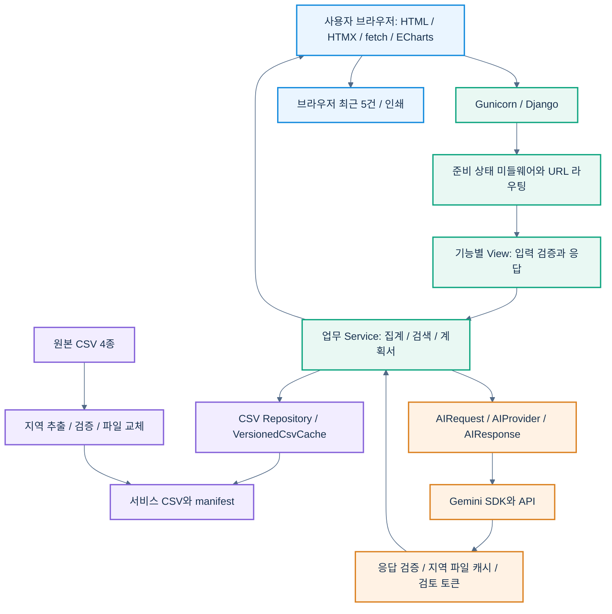
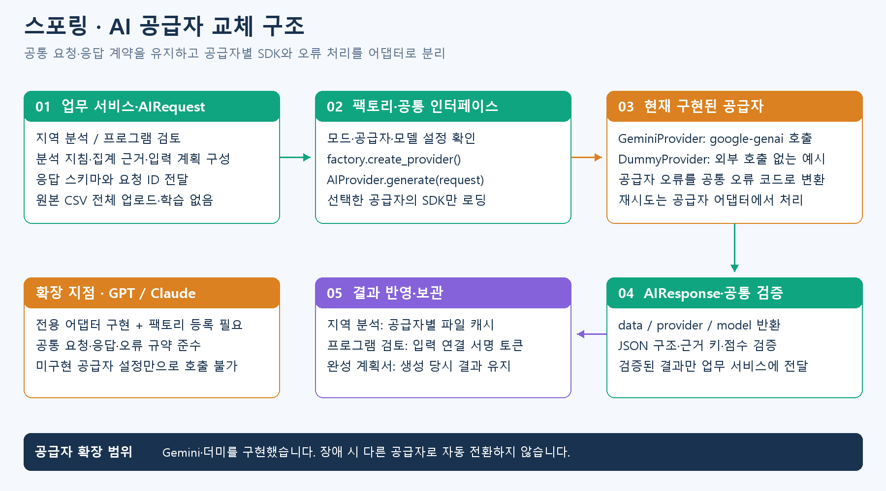
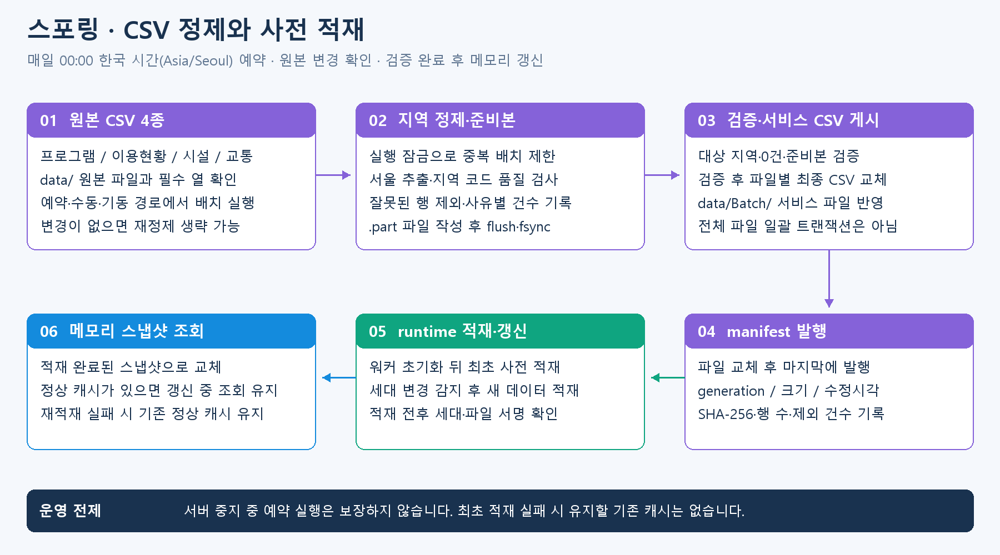
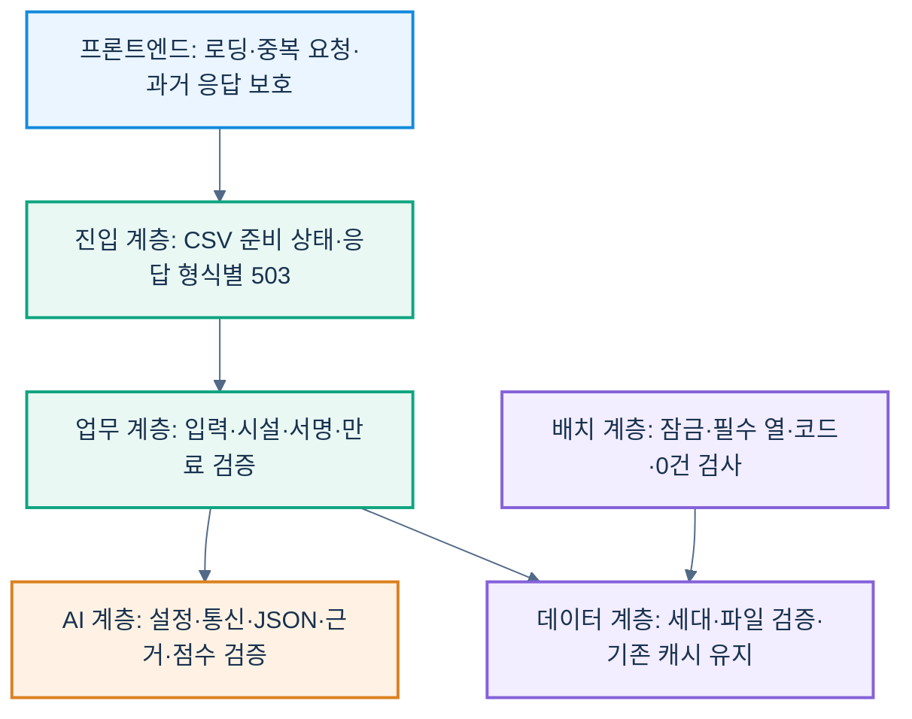

<p align="center">
  
</p>

# Hi스포링

**공공데이터를 함께 읽고, AI 검토를 통해 스포츠 프로그램 기획의 근거를 구체화하는 서비스**

지역별 체육 이용 실적과 기존 프로그램, 시설 정보를 조회하고 프로그램 설계부터 AI 검토·계획서 작성까지 연결하는 Django 기반 체육복지 정책의사결정 지원 플랫폼입니다.

[서비스 바로가기](https://kspo.onrender.com) · [프로젝트 저장소](https://github.com/kingdoms1212/kspo) · [프로젝트 개요 화면](https://kspo.onrender.com/overview)

> 작성 기준: 2026-09-28 로컬 구현 및 프로젝트 개요. 화면 이미지는 로컬 서비스에서 캡처했습니다. 운영 배포 상태나 외부 AI의 현재 가용성을 보장하는 자료는 아닙니다.

## 목차

1. [팀 소개](#team)
2. [프로젝트 개요](#overview)
3. [기술 스택·아키텍처·폴더 구조](#technology)
4. [WBS](#wbs)
5. [요구사항 명세서](#requirements)
6. [ERD](#erd)
7. [주요 프로시저·예외처리](#process)
8. [수행결과·테스트·시연 페이지](#results)
9. [한 줄 회고](#retrospective)

---

<a id="team"></a>
## 1. 팀 소개

**팀명:** [수기 입력]

| 이름 | 담당 영역 | 개인 GitHub |
|---|---|---|
| [수기 입력] | [수기 입력] | [수기 입력: GitHub 프로필 URL] |
| [수기 입력] | [수기 입력] | [수기 입력: GitHub 프로필 URL] |
| [수기 입력] | [수기 입력] | [수기 입력: GitHub 프로필 URL] |
| [수기 입력] | [수기 입력] | [수기 입력: GitHub 프로필 URL] |

<!-- 팀원 수에 맞춰 행을 조정하고 GitHub 칸은 [이름](https://github.com/계정) 형식으로 변경합니다. -->

<a id="overview"></a>
## 2. 프로젝트 개요

### 프로젝트 소개

**Hi스포링**은 공공기관 체육복지 담당자가 지역 현황을 확인하고 종목·시설·운영 정보를 선택해 프로그램 계획서를 작성하는 서비스입니다. 목적이 서로 다른 공공데이터를 지역·종목·시설이라는 공통 맥락에서 살펴보고, AI를 통해 주요 특징과 기획 시 보완할 점을 확인할 수 있습니다.


### 프로젝트 필요성 및 배경

공개된 이용 실적, 기존 프로그램 목록, 시설 현황은 각각 유용하지만 하나의 자료만으로 새 프로그램을 기획하기에는 판단 근거가 제한적입니다. 담당자는 여러 자료를 오가며 지역의 실적, 기존 강좌, 운영 가능한 시설을 확인하고 계획에 반영해야 합니다.

Hi스포링은 이 작업을 하나의 화면 흐름으로 연결합니다. **서로 관련 없어 보이는 공공데이터를 기획에 필요한 관계로 재발견하고, AI가 근거와 한계를 설명하도록 하는 것**이 핵심 방향입니다.

### 프로젝트 목표

| 지역 현황 확인 | 프로그램 설계 | AI 검토 | 계획서 완성 |
|:---:|:---:|:---:|:---:|
| 지도·이용 실적 | 종목·시설·운영안 | 근거·보완 의견 | 인쇄·최근 목록 |

- 지역별 이용 실적과 종목 분포를 조회해 프로그램 기획의 출발점을 제공합니다.
- 기존 강좌와 시설을 검색·비교해 운영안을 구체화하도록 돕습니다.
- AI 현황 해석과 프로그램 검토로 강점·위험요인·개선 제안을 확인합니다.
- 검토한 내용을 계획서로 정리하고 인쇄·최근 목록 복원을 제공합니다.

AI는 참고 의견을 제공하며 최종 기획과 운영 결정은 담당자가 수행합니다. 프로그램 자동 개설·승인이나 실제 운영 가능성의 확정을 의미하지 않습니다.

### 활용 데이터

| 데이터 | 서비스 활용 | 현재 AI 활용 범위 |
|---|---|---|
| 스포츠강좌이용권 이용현황 | 지역·종목별 시설·강좌·신청 실적 집계 | 지역 분석과 프로그램 검토의 통계 근거 |
| 공공체육시설 프로그램 | 기존 강좌 검색·비교·Excel 내보내기 | 담당자의 참고 자료이며 현재 AI 근거에는 직접 포함하지 않음 |
| 체육시설 현황 | 시설 조회·정상운영 후보 선택 | 선택 시설의 명칭·주소·유형·상태 |
| 시설 인접 교통 정보 | 연결 가능한 시설의 교통 상세 | 별도 설정으로 활성화하며 기본 비활성 |

**데이터 원칙**

- 신청 실적은 개설월별 누적 기록이며 고유 이용자 수나 지역 전체 수요가 아닙니다.
- 미제공 값과 관측된 0을 구분하고, 없는 인구·예산·수용능력을 추정해 채우지 않습니다.
- 시설 수만으로 공급 부족이나 프로그램 성공을 단정하지 않습니다.
- 서울 범위로 정제한 자료를 사용하며 외부 최신 원본을 자동 수집하는 서비스는 아닙니다.

<a id="technology"></a>
## 3. 기술 스택·아키텍처·폴더 구조

### 기술 스택

| 영역 | 기술 / 선언 버전 | 역할 |
|---|---|---|
| 서버 | Python 3.13.15 / Django 6.1.1 | 요청 처리·템플릿·폼 검증·서명 |
| 화면 | HTML / CSS / JavaScript | 사용자 입력과 설계 UI |
| 부분 갱신 | HTMX 2.0.4 / fetch | 조회 결과 부분 교체·JSON 요청 |
| 시각화 | ECharts 5.6.0 | 지역 지도와 분포 시각화 |
| AI | google-genai 2.24.0 | Gemini 호출·구조화 응답 |
| 설정 | python-dotenv 1.2.3 | 루트 .env 로딩 |
| 배치 | APScheduler 3.11.3 | 지역 CSV 정기 배치 |
| 정책·내보내기 | beautifulsoup4 4.15.0 / openpyxl 3.1.5 | 정책 HTML 파싱·Excel 생성 |
| 배포 | Render / Gunicorn 23 계열 / WhiteNoise 6.12.0 | 웹 서비스·정적 파일 제공 |
| 저장 | CSV·프로세스 메모리·파일 캐시·localStorage | 조회 데이터·지역 AI 결과·최근 계획서 |

버전은 설정·의존성 선언 기준입니다. Django 기본 SQLite 테이블과 스포츠 업무 데이터 저장은 구분합니다.

### 시스템 아키텍처


[아키텍처 이미지 크게 보기](docs/readme-assets/architecture.png)

> 파랑은 화면·정책 조회, 초록은 서버 처리, 보라는 CSV·캐시, 주황은 AI 연동을 나타냅니다. 첨부 도식의 작성일은 2026-09-25이며 아래 설명은 2026-09-28 프로젝트 개요를 기준으로 합니다. 현재 예약 배치는 **매일 00:00 한국 시간(Asia/Seoul)**입니다. 첨부 이미지의 일요일 예약 표기는 변경 전 설정입니다.

<details>
<summary><strong>아키텍처 연결 흐름 자세히 보기</strong></summary>



- 서버가 CSV를 읽고 집계한 HTML·JSON을 제공합니다. 브라우저가 원본 CSV를 직접 읽지 않습니다.
- 워커 초기화 이후 CSV를 사전 적재합니다. 세대 변경 시 새 적재를 완료한 후 메모리를 교체합니다.
- 지역 AI 결과는 서버 파일 캐시, 프로그램 검토는 입력에 연결한 서명 토큰, 완성 계획서는 브라우저 스냅샷으로 구분합니다.
- 운영 설정은 Gunicorn 1워커·gthread 4스레드·timeout 180초입니다. 메모리 캐시는 프로세스별로 독립적입니다.

</details>

### 프로젝트 폴더 구조

<details>
<summary><strong>패키지별 역할과 전체 폴더 구조</strong></summary>

```text
kspo/
├─ main/
│  ├─ main/                      # Django 설정·URL·WSGI/ASGI
│  ├─ app/
│  │  ├─ dashboard/              # 지역 집계·프로그램 설계·후보 선정
│  │  ├─ programs/               # 강좌 검색·비교·Excel
│  │  ├─ facilities/             # 시설 조회·교통 연결
│  │  ├─ planning/               # 계획서 구성·서명·복원
│  │  ├─ ai_review/
│  │  │  ├─ contracts.py         # 공통 요청·응답·공급자 계약
│  │  │  ├─ factory.py           # 공급자 선택
│  │  │  ├─ errors.py            # 공통 오류 코드
│  │  │  ├─ services.py          # 프로그램 검토
│  │  │  ├─ region_service.py    # 지역 분석·파일 캐시
│  │  │  ├─ prompts.py           # 분석 지침
│  │  │  ├─ schemas.py           # 응답 검증·점수 처리
│  │  │  └─ providers/           # Gemini·더미 어댑터
│  │  ├─ common/                # CSV·캐시·내보내기 공통 처리
│  │  ├─ shared/                # 지역 선택 정책
│  │  ├─ runtime/               # 사전 적재·준비 상태·갱신 감시
│  │  ├─ Batch/                 # 지역 CSV 배치
│  │  ├─ policies/              # 정책 목록
│  │  └─ overview/              # 프로젝트 개요
│  ├─ templates/                # Django 템플릿
│  ├─ static/                   # CSS·JS·지도·로컬 라이브러리
│  ├─ .ai-cache/                # 지역 AI 캐시, Git 제외
│  └─ requirements.txt
├─ data/Batch/                  # 서비스 CSV·manifest·로그
├─ docs/                        # 운영·설계 문서와 README 캡처
├─ scripts/                     # 실행·배포 스크립트
├─ image/ · fonts/ · theme/      # 공통 자산
├─ .env.example                 # 환경변수 예시
├─ render.yaml
└─ gunicorn.conf.py
```

**책임 분리:** View는 요청과 응답, Service는 업무 처리, Model/Repository는 CSV 접근, Template은 화면 표시를 담당합니다. 업무 `models.py`가 모두 Django ORM 테이블을 뜻하는 것은 아닙니다.

</details>

<a id="wbs"></a>
## 4. WBS

> 수기 입력: 팀에서 확정한 실제 일정·담당자·완료 기준을 작성합니다.

| 작업 ID | 작업 항목 | 담당자 | 시작일 | 종료일 | 완료 기준 | 상태 |
|---|---|---|---|---|---|---|
| [수기 입력] | [수기 입력] | [수기 입력] | [수기 입력] | [수기 입력] | [수기 입력] | [수기 입력] |

<a id="requirements"></a>
## 5. 요구사항 명세서

> 수기 입력: 실제 합의한 요구사항을 작성합니다. 아래 구현 설명을 승인된 요구사항으로 대신하지 않습니다.

| ID | 구분 | 요구사항 | 우선순위 | 검수 기준 | 구현 상태 |
|---|---|---|---|---|---|
| [수기 입력] | [수기 입력] | [수기 입력] | [수기 입력] | [수기 입력] | [수기 입력] |

<a id="erd"></a>
## 6. ERD

### CSV 파일 구성과 역할

현재 업무 데이터는 관계형 테이블 대신 CSV 파일로 관리합니다. 아래 표는 원본과 서울 서비스 파일의 대응 관계이며, DB의 PK·FK 제약을 의미하지 않습니다.

| 자료 | 원본 파일 (data/) | 서비스 파일 (data/Batch/) | 파일 설명 |
|---|---|---|---|
| 공공체육시설 프로그램 | public_sports_program.csv | public_sports_program_seoul.csv | 기존 강좌의 명칭·종목·요일·수강료 등. 프로그램 검색·비교에 사용 |
| 스포츠강좌이용권 이용현황 | sports_voucher_usage.csv | sports_voucher_usage_seoul.csv | 시설·강좌·개설월별 이용 기록. 지역·종목별 신청 실적 집계와 AI 통계 근거 |
| 체육시설 현황 | sports_facility_status.csv | sports_facility_status_seoul.csv | 시설명·주소·유형·운영상태 등. 상세 조회와 정상운영 설계 후보 선정 |
| 시설 인접 교통 | facility_transit.csv | facility_transit_seoul.csv | 시설 위치와 인접 교통 정보. 연결 가능한 시설의 교통 상세 조회 |

파일명의 _seoul은 서울 범위로 정제한 서비스 산출물이라는 뜻입니다. 배치는 원본을 지역별로 추출하며, 중복 제거·상태 필터·집계는 각 조회 모듈에서도 수행합니다.

### 파일 간 연결 기준

| 연결 대상 | 사용 기준 | 주의점 |
|---|---|---|
| 이용현황 내부 시설·강좌 | 지역 코드·시군구 코드·시설명·주소·상세주소, 강좌번호 | 집계용 식별 기준이며 다른 CSV의 공통 FK가 아님 |
| 시설 현황과 교통 | 정규화 시설명 + 위도·경도 소수점 6자리 | 이름만 같다고 연결하지 않음. 미연결은 주변 교통 부재를 의미하지 않음 |
| 선택 종목과 시설 후보 | 종목·시설유형/업종 대응표 + 지역 + 정상운영 | 업무 규칙에 따른 후보 선정이며 원본 파일 간 외래키 관계가 아님 |
| CSV와 manifest | generation·파일 크기·수정시각·SHA-256 | 게시 세대·파일 변경 검증용 메타데이터 |

**[수기 입력: 별도 DB 설계 시 확정 ERD와 엔터티·PK·FK·관계 설명]**

현재 스포츠 업무 데이터는 CSV와 메모리 캐시를 중심으로 처리합니다. Django 기본 SQLite 스키마를 업무 ERD로 해석하지 않습니다. 아래는 현재 저장 경계를 정리한 표입니다.

| 저장 대상 | 저장 위치 | 용도 |
|---|---|---|
| 스포츠 조회 자료 | 서비스 CSV·메모리 캐시 | 지역·강좌·시설 조회 |
| 데이터 세대·서명 | batch_manifest.json | 변경 감지·게시 검증 |
| 지역 AI 요약 | 서버 파일 캐시 | 동일 근거 재사용 |
| 프로그램 AI 검토 | 서버 서명 토큰 | 입력 일치·유효시간 검증 |
| 최근 계획서 | 브라우저 localStorage | 최근 5건 복원 |
| Django 기본 테이블 | SQLite 설정 | 프레임워크 기본 기능 |

<a id="process"></a>
## 7. 주요 프로시저·예외처리

여기서 프로시저는 애플리케이션의 주요 처리 흐름을 의미합니다.

### 프로그램 설계 흐름


[이미지 크게 보기](docs/readme-assets/program-design-flow.png) · [SVG 원본](docs/readme-assets/program-design-flow.svg)

1. **지역 선택:** 지도·행정구역에서 지역을 조회하고 이용 시설·강좌·신청 실적·종목 분포를 확인합니다.
2. **종목·시설 선택:** 정상운영 후보의 상세·교통 정보를 확인하고 최대 20곳을 선택합니다. 실제 후보가 없을 때만 동의 후 시설 미정으로 진행합니다.
3. **정보 입력:** 프로그램명·모집인원·수강료·대상·기간·내용을 입력합니다. 수강료는 천 단위 쉼표로 표시하고 서버에는 정수로 전달합니다.
4. **AI 검토 또는 생략:** 현재 입력의 유효한 AI 결과가 있거나 AI 없이 생성하기를 선택해야 계획서를 완성할 수 있습니다.
5. **완성과 복원:** 생성 이후에도 STEP 03을 유지합니다. 최근 5건 복원·인쇄 시 AI를 재호출하지 않습니다.
6. **처음으로:** 입력·시설·화면의 AI 상태를 초기화하고 STEP 01 상단으로 이동합니다. 최근 5건과 서버 지역 AI 캐시는 삭제하지 않습니다.

### 지역 AI 분석과 프로그램 AI 검토


*분석 실행 전 화면입니다. 이 캡처는 실제 AI 응답 성공을 증명하는 이미지가 아닙니다.*

| 기능 | 요청 시점 | 결과와 보관 |
|---|---|---|
| 지역 현황 분석 | AI로 분석하기 버튼 클릭 | 요약·특징·확인할 점, 서버 파일 캐시 24시간·최대 200건 |
| 프로그램 검토 | STEP 03 AI 분석 버튼 클릭 | 항목별 의견·점수·강점·위험·개선 제안, 1시간 검토 토큰 |
| 계획서 반영 | 유효 결과의 포함 여부 선택 | 생성 당시 결과를 계획서에 고정 |

- 지역 조회만으로 AI를 호출하지 않습니다. 다른 지역 조회 시 이전 결과를 유지하고 재분석이 필요한 상태를 알립니다.
- 동일 입력의 유효한 검토 결과는 재분석을 막습니다. 입력 변경 시 이전 결과는 참고용으로 유지하고 계획서 포함 선택을 해제합니다.
- AI 항목별 점수와 근거 키를 검증한 뒤 서버가 평가 가능한 점수의 동일 가중 평균·등급을 계산합니다. 모든 점수가 없으면 **판단 자료 부족**으로 표시합니다.
- 원본 CSV 전체를 업로드하거나 모델을 사전 학습하지 않습니다. 필요한 집계·시설 정보·사용자 입력을 요청 근거로 구성합니다.

### AI 공급자 교체 구조



[이미지 크게 보기](docs/readme-assets/ai-provider-structure.png) · [SVG 원본](docs/readme-assets/ai-provider-structure.svg)

현재 Gemini와 더미 공급자를 구현했습니다. GPT·Claude는 공급자 어댑터 구현과 팩토리 등록 후 사용할 수 있습니다. 설정값 변경만으로 미구현 공급자가 작동하거나 장애 시 다른 공급자로 자동 전환되지는 않습니다.

### CSV 정제·사전 적재

**정기 실행: 매일 00:00, 한국 시간(Asia/Seoul).** 서버 프로세스 안의 APScheduler가 실행합니다. 서버가 중지된 동안의 예약 실행을 보장하지 않으며, 원본 변경이 없으면 재정제를 생략할 수 있습니다.



[이미지 크게 보기](docs/readme-assets/csv-pipeline.png) · [SVG 원본](docs/readme-assets/csv-pipeline.svg)

- 실행 잠금으로 배치 중복 실행을 제한합니다.
- 지역 코드가 잘못된 행 등을 제외하고 사유를 기록합니다. 대상 행이 0건이면 게시를 거부합니다.
- 모든 준비본을 검증한 뒤 파일별로 교체하고 manifest를 마지막에 발행합니다.
- 적재 전후 세대·파일 서명을 검사합니다. 재적재 실패 시 기존 정상 캐시가 있으면 유지합니다.
- 네 파일 전체 교체의 단일 트랜잭션이나 전체 자동 롤백을 제공하는 구조는 아닙니다.

### 예외처리 구조


[예외처리 이미지 크게 보기](docs/readme-assets/exception-handling.png)

> 도식의 01~06은 요청·캐시·배치·AI·정책·Excel의 연결 지점을 구분합니다. 장애가 난 구간을 안내하고 기존 정상 데이터와 가능한 기능을 유지하는 구조입니다. 모든 장애의 자동 복구를 의미하지 않습니다.

<details>
<summary><strong>계층별 처리 흐름과 예외처리 상세표</strong></summary>



| 계층 / 상황 | 처리 | 한계·후속 동작 |
|---|---|---|
| 조회 응답 역전 | 요청 버전으로 과거 응답 무시 | 최신 요청 결과만 표시 |
| 로딩·조회 실패 | 오류 안내, finally에서 로딩 해제 | 자동 재시도와 구분 |
| CSV 초기 준비 | loading·missing은 형식에 맞는 503, Retry-After | stalled는 요청을 통과시켜 직접 적재 허용 |
| 입력 오류 | 날짜 순서·인원·금액·시설 개수 검사 | 오류 항목 재입력 |
| 시설 선택 | 2시간 서명 토큰과 현재 후보 대조 | 변조·만료·불일치 시 재선택 |
| 결과 복원 | 서명·구조·크기 검사 | 손상 결과 복원 거부 |
| AI 연동 [SG003] | 키·SDK·통신·시간 초과·JSON·근거·점수 검증 | 실패 안내 후 기본 계획서 이용 가능 |
| AI 재시도 [SG003] | 429·500·502·503·504만 최대 10회 재시도 | 최초 호출 이후 횟수이며 전체 응답시간은 길어질 수 있음 |
| AI 검토 토큰 [SG003] | 1시간 유효시간·입력·시설 일치 검사 | 재검토 또는 포함 해제 |
| 지역 AI 캐시 [SG003] | 손상 캐시 재분석, 쓰기 실패 시 결과 제공 | 분석 중 CSV 세대 변경 시 캐시 저장 안 함 |
| 정책 목록 | 다이얼로그·로딩 먼저 표시, 오류 문구 제공 | 서버 크롤링 자체는 동기 방식 |
| 브라우저 저장 | 파싱·용량·저장 실패 처리 | 보관 실패가 생성·인쇄를 막지 않도록 처리 |
| Excel | 최대 50,000행 제한 | 초과 시 조건 축소 안내 |
| CSV 재적재 | 세대·파일 서명 확인 후 교체 | 최초 적재 실패 시 유지할 기존 캐시 없음 |

**기동 대기 문제 개선:** Gunicorn master에서 CSV 갱신 스레드를 시작하면 fork 후 잠금·스레드 상태가 불일치할 수 있어, 워커 초기화 이후 적재와 스케줄러를 시작하도록 분리했습니다. 준비 상태와 PID별 `CSV_DIAG` 로그로 추적합니다.

**AI 진단:** 요청 ID로 처리 단계·SDK 설정·응답 상태·오류 분류를 기록합니다. API 키·사용자 작성 내용·AI 응답 본문은 로그에 남기지 않습니다. 프로세스당 AI 분석은 1건으로 제한합니다.

</details>

<a id="results"></a>
## 8. 수행결과·테스트·시연 페이지

### 주요 구현 화면

#### 프로그램 현황

지역·종목·요일·수강료 등의 조건으로 검색하고 기존 강좌를 비교하며 Excel로 내보냅니다.


#### 시설 현황

지역·시설 유형·운영상태로 검색하고 시설 상세와 연결 가능한 인접 교통 정보를 확인합니다.


캡처 기준: 2026-09-28 로컬 서비스의 조회 화면. 표시 건수는 CSV 행 수가 아니라 화면별 정제·집계·필터 결과입니다.

### 시연 순서

1. 지역 선택·조회 후 지표와 종목 분포를 확인합니다.
2. 지역 AI 분석 버튼으로 현황 요약을 확인합니다.
3. 종목과 시설을 선택하고 프로그램 내용을 입력합니다.
4. 프로그램 AI 검토 또는 AI 없이 생성하기를 선택합니다.
5. 계획서를 완성하고 인쇄·최근 목록 복원을 확인합니다.

**발표용 시연 영상:** [수기 입력: 영상 URL]

### 테스트 기록

| 항목 | 확인 결과 | 비고 |
|---|---|---|
| 프로젝트 개요 화면·AI 설명 | 6개 테스트 통과 | 2026-09-28 로컬 실행 |
| 대시보드·프로그램·시설 화면 | 로컬 화면 열림과 캡처 확인 | 기능 전체 회귀 테스트는 아님 |
| 설계·복원·인쇄 | [수기 입력] | 실제 테스트 일시·증빙 입력 |
| AI 성공·실패·재분석 | [수기 입력] | 실제 공급자 호출 결과 입력 |
| 배치·초기화·갱신 | [수기 입력] | 실제 테스트 일시·증빙 입력 |
| 운영 환경·통합 시연 | [수기 입력] | Render 환경에서 별도 확인 |

### 실행 및 환경 설정

<details>
<summary><strong>로컬 실행 명령과 AI 환경변수</strong></summary>

Python 가상환경에서 `main/requirements.txt`를 설치하고 원본 데이터를 준비합니다. 데이터 압축 해제·배치·운영 배포의 세부 절차는 [Render 배포 안내](docs/RENDER-DEPLOYMENT.md)를 참고합니다.

```powershell
python -m venv .venv
.\.venv\Scripts\python.exe -m pip install -r main/requirements.txt
.\.venv\Scripts\python.exe main/manage.py migrate
.\.venv\Scripts\python.exe main/manage.py runserver 127.0.0.1:8000
```

루트 `.env` 예시:

```dotenv
AI_MODE=live
AI_PROVIDER=gemini
AI_MODEL=gemini-3.1-flash-lite
AI_TIMEOUT_SECONDS=25
AI_MAX_RETRIES=10
GEMINI_API_KEY=발급받은_API_키
AI_REVIEW_INCLUDE_TRANSIT=false
```

외부 호출 없는 동작 확인에는 `AI_MODE=dummy`를 사용합니다. 더미 결과는 실제 AI 검토 성과와 구분합니다. Render에서는 같은 변수를 Environment에 등록하며 기존 OS·Render 환경변수가 `.env`보다 우선합니다. 실제 `.env`와 API 키는 Git에 포함하지 않습니다.

</details>

### 현재 제약사항

- 대시보드는 서울 중심이며 시설 후보가 공공시설로만 제한되지는 않습니다.
- 대관·강사·접수·결제·개설 확정과 실제 문자·카카오톡 발송은 구현 범위 밖입니다.
- 최근 계획서는 해당 브라우저 5건이며 계정·기기 간 동기화가 없습니다.
- AI 재시도는 수 분 걸릴 수 있으며 프록시 제한으로 먼저 연결이 종료될 수 있습니다.
- 프로세스 간 전역 AI 호출 제한, 사용자별 할당량, 일일 비용 제한은 미구현입니다.
- 파일 캐시는 배포 환경에 따라 초기화될 수 있습니다. 실제 기관 도입·정량적 효과는 별도 검증이 필요합니다.

<a id="retrospective"></a>
## 9. 한 줄 회고

| 팀원 | 한 줄 회고 |
|---|---|
| [수기 입력] | [수기 입력: 직접 경험한 문제·배운 점·개선점] |
| [수기 입력] | [수기 입력] |
| [수기 입력] | [수기 입력] |
| [수기 입력] | [수기 입력] |

---

### 관련 문서 및 작성 근거

- [프로젝트 개요 템플릿](main/templates/overview/index.html)
- [AI 공통 계약](main/app/ai_review/contracts.py) · [공급자 팩토리](main/app/ai_review/factory.py)
- [지역 배치](main/app/Batch/regional_csv_batch.py) · [Gunicorn 설정](gunicorn.conf.py)
- [라이브러리 선언](main/requirements.txt) · [Render 배포 안내](docs/RENDER-DEPLOYMENT.md)
- [참고 README](https://github.com/encore-ai-campus/aio-02-p1-team4): 소개·기능·화면·기술 구성의 표현 방식을 참고했습니다. 해당 서비스의 팀원·기술·성과를 Hi스포링 정보로 옮기지 않았습니다.

<!-- README와 docs/readme-assets를 함께 저장소에 반영해야 캡처 이미지가 표시됩니다. Mermaid 도식은 GitHub README에서 렌더링됩니다. -->
