<p align="center">

  

</p>


# Hi스포링


### Hi스포링 이름의 의미


**Hi스포링**은 사람(Human)과 인공지능(AI)을 의미하는 HI와 스포츠(Sports)와 연결(Ring)의 의미를 담은 스포링을 결합한 서비스명입니다.


사람의 판단과 인공지능의 데이터 분석을 결합하여 지역 특성에 적합한 체육 프로그램을 제안하고, 지역사회와 스포츠·체육복지를 연결한다는 의미를 담고 있습니다.


## 목차


1. [팀 소개](#team)

2. [프로젝트 개요](#overview)

3. [기술 스택·아키텍처·폴더 구조](#technology)

4. [WBS](#wbs)

5. [요구사항 명세서](#requirements)

6. [데이터 구조 및 저장 구조](#data-structure)

7. [주요 처리 흐름 및 예외처리](#process)

   - [7-1. 프로그램 설계 흐름](#program-design-flow)
   - [7-2. AI 분석·검토 및 연동 흐름](#ai-analysis-flow)
   - [7-3. 예외처리 구조](#exception-handling)
   - [7-4. 주요 정책 크롤링 흐름](#policy-crawling)

8. [구현 결과·테스트·시연](#results)

9. [한 줄 회고](#retrospective)

10. [현재 제약사항 및 향후 개선사항](#improvements)

- [부록 · 실행 및 참고 자료](#appendix)


---


<a id="team"></a>

## 1. 팀 소개


**팀명:** 설홍길


| 이름 | 담당 영역 | 개인 GitHub |
|---|---|---|
| 홍석환 | 팀장 · 프로그램 설계 기능 개발 | [SeokHwanHong](https://github.com/SeokHwanHong) |
| 서정길 | 팀원 · 시설 현황 및 AI 연동 개발 | [kingdoms1212](https://github.com/kingdoms1212) |
| 설호현 | 팀원 · 프로그램 현황 및 CSV 정제 개발 | [seoloo](https://github.com/seoloo) |

<a id="overview"></a>

## 2. 프로젝트 개요


### 프로젝트 소개


**Hi스포링**은 공공기관 체육복지 담당자가 지역별 체육 이용 현황과 기존 프로그램, 체육시설 등의 공공데이터를 한곳에서 확인하고, 이를 바탕으로 지역에 적합한 체육 프로그램을 설계할 수 있도록 지원하는 **체육복지 정책 의사결정 지원 플랫폼**입니다.


사용자는 지역 현황을 분석한 뒤 종목·시설·운영 정보를 선택하여 신규 체육 프로그램을 설계할 수 있으며, AI는 **제공된 근거 범위에서 지역 현황과 프로그램·시설 적합성을 검토합니다.** 분석 결과는 프로그램 기획의 보완 자료로 활용되며, 최종적으로 **체육 프로그램 운영 계획서 작성까지 하나의 흐름으로 연결**됩니다.


이를 통해 단순한 체육시설 및 프로그램 정보 조회를 넘어, **공공데이터와 AI를 활용해 담당자의 정책적 판단을 지원하고 지역 특성에 맞는 체육복지 프로그램의 기획과 의사결정을 돕는 것**을 목표로 합니다.


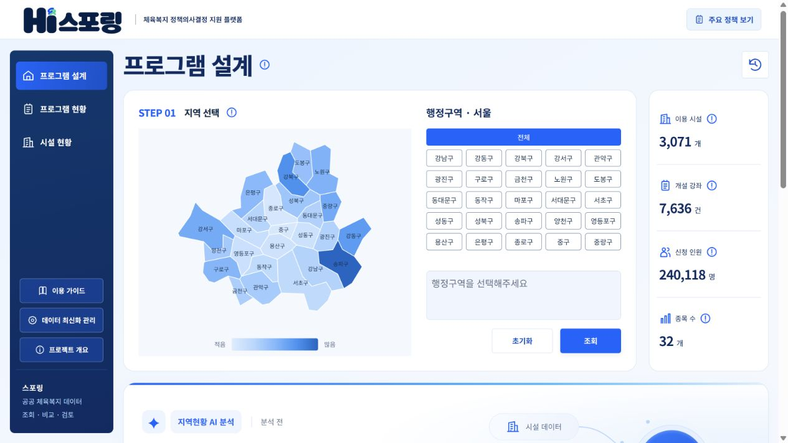

*지역 현황을 확인하고 프로그램 설계를 시작하는 대시보드*

### 프로젝트 필요성 및 배경


지역에 맞는 체육복지를 실현하려면 주민의 체육활동 이용 실적과 기존 프로그램, 활용 가능한 시설을 함께 살펴보고 이를 프로그램 기획에 반영해야 합니다. **스포츠강좌이용권 이용현황 정보, 공공체육시설 프로그램 정보, 전국 공공체육시설 데이터**를 종합적으로 활용하면 지역별 이용 특성과 프로그램 운영 현황, 시설 자원을 연계하여 체육복지 사업을 보다 효율적으로 기획할 수 있습니다.


Hi스포링은 이 세 가지 공공데이터를 **지역·종목·시설을 중심으로 함께 살펴볼 수 있는 기획 환경**을 제공합니다. AI는 제공된 데이터를 바탕으로 지역별 이용 특성을 해석하고, 설계 중인 프로그램의 강점과 위험요인을 분석하여 구체적인 개선 방향을 제안합니다. 이를 통해 담당자가 **데이터에서 기획의 실마리를 찾고 프로그램을 구체화·보완하는 과정을 능동적으로 지원**합니다. 기존 체육시설과 프로그램 자원을 효과적으로 활용하고, 지역 특성에 맞는 새로운 프로그램을 발굴하여 주민의 체육활동 참여 기회를 넓히는 것이 목표입니다.


### 주요 기능 및 서비스 흐름


| 주요 기능 | 역할 |
|---|---|
| 지역 현황 확인 | 지역별 이용 실적과 종목 분포를 조회하여 프로그램 기획을 위한 기초 정보를 제공합니다. |
| 프로그램 설계 | 기존 강좌와 체육시설을 검색·비교하고 종목·시설·운영 정보를 선택하여 프로그램 운영안을 구체화합니다. |
| AI 검토 | 제공된 데이터에서 지역별 이용 특성과 기획 시 고려할 점을 도출하고, 설계 중인 프로그램의 강점·위험요인을 분석하여 구체적인 개선 방향을 제안함으로써 프로그램의 구체화와 보완을 지원합니다. |
| 계획서 완성 | 검토한 내용을 체육 프로그램 운영 계획서로 정리하고 인쇄 및 최근 계획서 복원 기능을 제공합니다. |

### 활용 데이터


| 데이터 | 서비스 활용 |
|---|---|
| 스포츠강좌이용권 이용현황 | 지역·종목별 시설·강좌·신청 실적 집계 및 AI 지역 분석의 통계 근거로 활용 |
| 공공체육시설 프로그램 | 기존 강좌 검색·비교 및 Excel 내보내기 |
| 체육시설 현황 | 시설 조회 및 정상운영 시설 후보 선택 |
| 시설 인접 교통 정보 | 선택 시설과 연결 가능한 인접 대중교통 정보 조회 |


> 공공데이터 중 지역 통계 분석의 주요 근거는 **스포츠강좌이용권 이용현황 데이터**이며, 프로그램 AI 검토 시에는 선택 시설 정보와 사용자가 입력한 프로그램 정보도 함께 활용합니다. 나머지 데이터는 프로그램 설계와 시설·교통 정보 조회를 지원하는 용도로 사용합니다.


### 데이터 활용 원칙


- 확인 가능한 공공데이터의 이용현황·신청 실적을 **지역 수요를 가늠하는 기초 지표**로 활용합니다. 다만 최신 수요나 지역 전체의 잠재 수요를 직접 나타내는 값은 아닙니다.

- **이용 실적이 높은 지역뿐 아니라 이용이 저조하거나 체육서비스가 부족한 지역도 프로그램 설계 대상**으로 고려합니다. 낮은 실적을 수요 부재로 단정하지 않고 참여 기회 확대 관점에서 기획합니다.

- 미제공 값과 실제 관측된 0을 구분하며, 제공되지 않은 인구·예산·수용능력 등의 값을 임의로 추정하지 않습니다.

- 시설 수만으로 지역의 시설 공급 부족이나 프로그램의 성공 가능성을 단정하지 않습니다.

- 서울 범위로 정제한 데이터를 사용하며 외부 최신 원본 데이터를 실시간으로 자동 수집하는 서비스는 아닙니다.


<a id="technology"></a>

## 3. 기술 스택·아키텍처·폴더 구조

### 3-1. 기술 스택


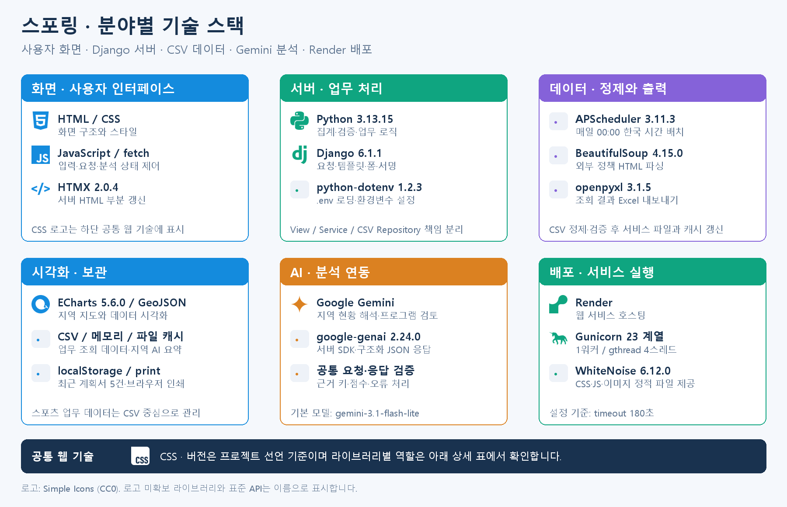


> 화면·서버·데이터·AI·배포 영역은 시스템 아키텍처와 동일한 기준으로 구분했습니다.
> 로고는 [Simple Icons](https://github.com/simple-icons/simple-icons)의 공개 자산을 사용했으며, 전용 로고를 확보하지 못한 라이브러리와 표준 API는 이름으로 표시했습니다.
> [로고 라이선스](docs/readme-assets/logos/LICENSE.md)

[기술 스택 이미지 크게 보기](docs/readme-assets/tech-stack.png)

<details>

<summary><strong>기술 스택 상세 버전 보기</strong></summary>


<br>


| 영역 | 기술 / 선언 버전 | 역할 |
|---|---|---|
| 서버 | Python 3.13.15 / Django 6.1.1 | 요청 처리·템플릿·폼 검증·서명 |
| 화면 | HTML / CSS / JavaScript | 사용자 입력과 설계 UI |
| 부분 갱신 | HTMX 2.0.4 / fetch | 조회 결과 부분 교체·JSON 요청 |
| 시각화 | ECharts 5.6.0 | 지역 지도와 분포 시각화 |
| AI | google-genai 2.24.0 | Gemini 호출·구조화 응답 |
| 설정 | python-dotenv 1.2.3 | 루트 `.env` 로딩 |
| 배치 | APScheduler 3.11.3 | 지역 CSV 정기 배치 |
| 정책·내보내기 | beautifulsoup4 4.15.0 / openpyxl 3.1.5 | 정책 HTML 파싱·Excel 생성 |
| 배포 | Render / Gunicorn 23 계열 / WhiteNoise 6.12.0 | 웹 서비스·정적 파일 제공 |
| 저장 | CSV·프로세스 메모리·파일 캐시·localStorage | 조회 데이터·지역 AI 결과·최근 계획서 |


</details>

### 3-2. 시스템 아키텍처

Hi스포링은 **Django 백엔드를 중심으로 사용자 화면, CSV 기반 공공데이터, 외부 정책 정보, Gemini AI 분석을 연결하는 구조**로 구성했습니다.

**사용자 요청 → 프론트엔드 → Django 업무 처리 → CSV 데이터 조회·집계 → 선택적 AI 분석 → 화면·계획서·Excel 응답**


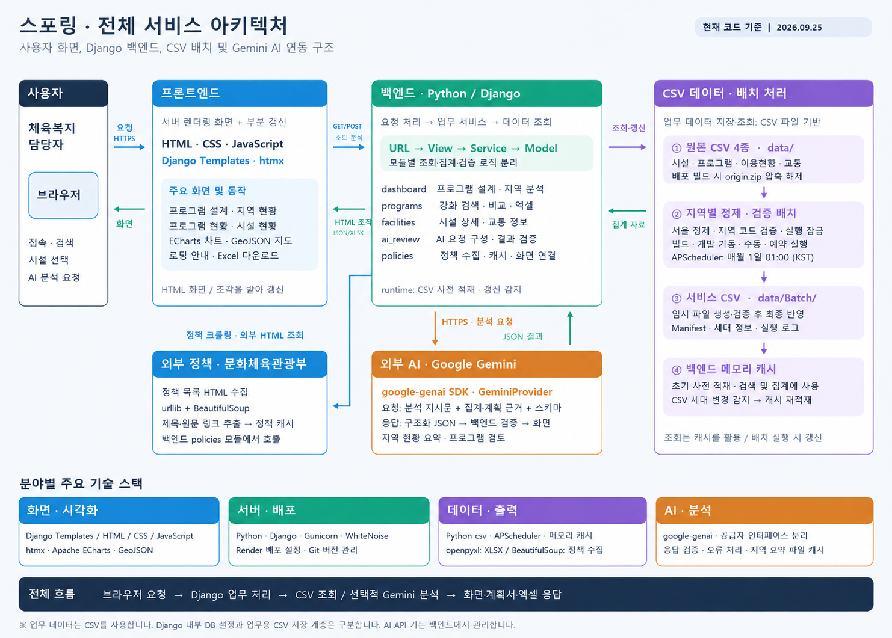


> 파랑은 화면·외부 정책 조회, 초록은 서버 처리, 보라는 CSV·캐시, 주황은 AI 연동 영역을 나타냅니다.


[아키텍처 이미지 크게 보기](docs/readme-assets/architecture.png)


### 3-3. 구성 영역별 역할

| 영역 | 역할 | 주요 구성 |
|---|---|---|
| 사용자 화면 | 지역·시설 선택, 부분 갱신, 지도·차트 표시 | Django Templates · HTMX · ECharts |
| 업무 처리 | 입력 검증, 검색·집계, 프로그램 설계·계획서 구성 | dashboard · programs · facilities · planning |
| 데이터 관리 | 서울 CSV 정제·검증, 서비스 파일 발행, 메모리 적재 | Batch · runtime · CSV Repository |
| 외부 정책 | 문화체육관광부 정책 목록 수집·캐시 | policies · BeautifulSoup |
| AI 연동 | 분석 근거 구성, Gemini 호출, 응답 검증 | ai_review · google-genai |
| 결과 제공 | HTML·JSON·Excel 응답, 계획서 인쇄·최근 5건 복원 | Django 응답 · openpyxl · localStorage |

데이터 선정·저장·배치 기준은 [6번 데이터 구조](#data-structure), 프로그램 설계·AI 연동·오류 대응은 [7번 주요 처리 흐름](#process)에서 설명합니다.

### 3-4. 프로젝트 폴더 구조

기능별 패키지의 역할과 전체 폴더 구조는 다음과 같습니다.

```text
kspo/
├─ main/
│  ├─ main/                      # Django 설정·URL·WSGI/ASGI
│  ├─ app/
│  │  ├─ dashboard/              # 지역 집계·프로그램 설계·후보 선정
│  │  ├─ programs/               # 강좌 검색·비교·Excel
│  │  ├─ facilities/             # 시설 조회·교통 연결
│  │  ├─ planning/               # 계획서 구성·서명·복원
│  │  ├─ ai_review/
│  │  │  ├─ contracts.py         # 공통 요청·응답·공급자 계약
│  │  │  ├─ factory.py           # 공급자 선택
│  │  │  ├─ errors.py            # 공통 오류 코드
│  │  │  ├─ services.py          # 프로그램 검토
│  │  │  ├─ region_service.py    # 지역 분석·파일 캐시
│  │  │  ├─ prompts.py           # 분석 지침
│  │  │  ├─ schemas.py           # 응답 검증·점수 처리
│  │  │  └─ providers/           # Gemini·더미 어댑터
│  │  ├─ common/                # CSV·캐시·내보내기 공통 처리
│  │  ├─ shared/                # 지역 선택 정책
│  │  ├─ runtime/               # 사전 적재·준비 상태·갱신 감시
│  │  ├─ Batch/                 # 지역 CSV 배치
│  │  ├─ policies/              # 정책 목록
│  │  └─ overview/              # 프로젝트 개요
│  ├─ templates/                # Django 템플릿
│  ├─ static/                   # CSS·JS·지도·로컬 라이브러리
│  ├─ .ai-cache/                # 지역 AI 캐시, Git 제외
│  └─ requirements.txt
├─ data/Batch/                  # 서비스 CSV·manifest·로그
├─ docs/                        # 운영·설계 문서와 README 캡처
├─ scripts/                     # 실행·배포 스크립트
├─ image/ · fonts/ · theme/      # 공통 자산
├─ .env.example                 # 환경변수 예시
├─ render.yaml
└─ gunicorn.conf.py
```

<a id="wbs"></a>

## 4. WBS

> 작업 코드는 프로젝트 수행 내역을 기능 영역별로 정리하기 위해 문서화 단계에서 부여한 관리 코드입니다.

| 작업 코드 | 작업 항목 | 담당자 | 시작일 | 종료일 | 완료 기준 |
|---|---|---|---|---|---|
| DASH-01 | 지역 현황 대시보드 모듈 개발 | 홍석환 | 2026-09-15 | 2026-09-16 | 지역별 현황 조회 및 화면 출력 확인 |
| PLAN-01 | 프로그램 설계 기능 개발 | 홍석환 | 2026-09-16 | 2026-09-17 | 프로그램 입력·설계 흐름 정상 동작 확인 |
| PLAN-02 | 프로그램 설계 예외처리 보완 | 홍석환 | 2026-09-17 | 2026-09-18 | 주요 입력 및 설계 예외 상황 처리 확인 |
| AI-UI | AI 기능 UI 및 사용자 흐름 보완 | 홍석환 | 2026-09-21 | 2026-09-23 | AI 분석 요청·결과 화면 동작 확인 |
| FAC-01 | 시설 현황 조회 모듈 개발 | 서정길 | 2026-09-15 | 2026-09-16 | 시설 조회 및 상세 정보 화면 출력 확인 |
| UI-01 | 서비스 UI/UX 개선 | 서정길 | 2026-09-16 | 2026-09-17 | 주요 화면 레이아웃 및 사용자 흐름 확인 |
| INFRA-01 | Render 서비스 배포 | 서정길 | 2026-09-18 | 2026-09-18 | 배포 환경에서 서비스 정상 실행 확인 |
| AI-API | Gemini AI 연동 모듈 개발 | 서정길 | 2026-09-22 | 2026-09-23 | AI 요청·응답 및 서버 로그 확인 |
| PROG-01 | 프로그램 현황 조회 모듈 개발 | 설호현 | 2026-09-15 | 2026-09-17 | 프로그램 검색 및 조회 화면 정상 출력 확인 |
| DATA-01 | CSV 데이터 처리 모듈 개발 | 설호현 | 2026-09-17 | 2026-09-19 | CSV 정제·처리 결과 및 실행 로그 확인 |
| DATA-02 | CSV 데이터 처리 수동 모듈 연동 | 설호현 | 2026-09-20 | 2026-09-21 | CSV 정제·처리 화면 및 로그 확인 |
| DATA-03 | CSV 데이터 처리 예외처리 보완 | 설호현 | 2026-09-22 | 2026-09-23 | 데이터 오류·예외 상황 처리 및 로그 확인 |


<a id="requirements"></a>

## 5. 요구사항 명세서

> 프로젝트의 주요 기능을 사용자 관점의 요구사항으로 구분하여 정리했습니다.

| ID | 구분 | 요구사항 |
|---|---|---|
| REQ-01 | 지역 현황 분석 | 사용자는 지역별 체육 이용 현황과 종목 분포를 조회하고 프로그램 기획에 필요한 기초 정보를 확인할 수 있어야 합니다. |
| REQ-02 | 프로그램 설계 | 사용자는 종목, 시설, 대상, 기간, 모집인원, 수강료 등의 정보를 입력하여 지역 특성에 맞는 체육 프로그램을 설계할 수 있어야 합니다. |
| REQ-03 | 프로그램·시설 조회 | 사용자는 기존 체육 프로그램과 체육시설 정보를 검색·조회하고 프로그램 기획 및 시설 선정에 활용할 수 있어야 합니다. |
| REQ-04 | AI 분석 및 검토 | 사용자는 지역 현황과 설계한 프로그램을 AI를 통해 분석하고, 프로그램의 특징·위험요인·개선 방향 등의 검토 의견을 확인할 수 있어야 합니다. |
| REQ-05 | 데이터 처리 | 시스템은 공공데이터 CSV를 서비스에서 활용할 수 있도록 정제·검증·관리하고, 지역 및 프로그램 조회에 필요한 데이터를 안정적으로 제공해야 합니다. |
| REQ-06 | 계획서 생성 | 사용자는 입력한 프로그램 정보와 AI 검토 결과를 기반으로 체육 프로그램 운영 계획서를 생성하고 인쇄할 수 있어야 합니다. |
| REQ-07 | 서비스 운영 | 서비스는 배포 환경에서 정상적으로 동작해야 하며, 데이터 조회·AI 연동·화면 처리 과정에서 발생하는 주요 오류를 적절히 처리해야 합니다. |


<a id="data-structure"></a>
## 6. 데이터 구조 및 저장 구조

### 6-1. CSV를 사용하는 이유와 적용 범위

**서울 지역 프로그램 기획에 필요한 데이터만 정제해 CSV와 메모리 캐시로 제공합니다.** 현재 범위에서 전국 원본 전체를 반복 적재·색인하는 비용과 별도 업무 DB 운영 부담을 줄이기 위한 선택입니다.

- **제공 방식:** 선정 데이터 중 `서울올림픽기념국민체육진흥공단_공공체육시설 상세 정보_GW`만 API로 접근할 수 있고, 나머지 데이터는 API 접근이 불가능하여 전체 데이터 처리 구조를 CSV 기반으로 기획했습니다.
- **서비스 범위:** 현재 기획 대상은 서울입니다. 배치에서 전국 원본을 읽어 서울 행만 추출하고, 서비스는 서울 데이터만 메모리에 적재합니다.
- **확장 방향:** 전국 서비스 전환 시 DB 저장·색인 구조로 확대할 계획입니다. 현재 CSV 선택과 서울 필터링은 각각 저장 방식과 처리 범위에 대한 결정입니다.

### 6-2. 데이터 갱신 및 정제 흐름

**매월 1일 01:00 (Asia/Seoul)에 원본 변경 여부를 점검하고, 변경된 원본을 서울 서비스 데이터에 반영합니다.** 매월 최신 데이터를 기준으로 서비스를 운영하기 위해 월 단위 갱신 주기를 적용하였으며, 매월 1일을 데이터 최신화 기준일로 설정하였습니다. 실행 시간인 01시는 사용자 접속이 비교적 적을 것으로 예상되는 시간대로 임의 산정하였으며, 실제 서비스 운영 환경에 따라 추후 변경할 수 있습니다. 또한 해당 시간은 제공기관의 데이터 갱신 시각을 의미하지 않습니다.

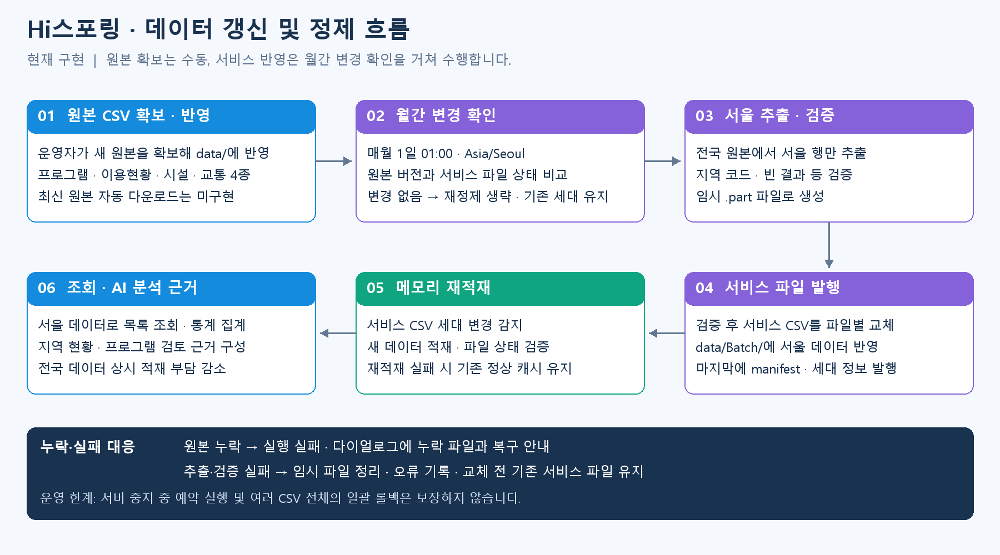

[이미지 크게 보기](docs/readme-assets/data-refresh-flow.png) · [SVG 원본](docs/readme-assets/data-refresh-flow.svg)

**원본 확보와 서비스 반영은 별개입니다.** 원본 CSV를 갱신할 수 있는 API가 없어 현재 배치는 외부의 최신 자료를 자동 다운로드하지 않습니다. 운영자가 새 원본을 반영해야 서비스 데이터도 최신 자료로 바뀝니다. 월간 실행 자체가 원본의 최신성을 보장하지 않으며, 기관별 실제 갱신일·주기가 확인되면 그 일정에 맞춰 조정할 대상입니다.

| 상황 | 현재 처리 |
|---|---|
| 원본 변경 없음 | 원본 버전과 서비스 파일 상태가 같으면 재정제·세대 갱신을 생략하고 `원본 변경 없음`을 기록합니다. 수정시각만으로 판단하지는 않습니다. |
| 원본 변경 또는 서비스 파일 누락 | 서울 데이터를 추출·검증하고 서비스 CSV와 `batch_manifest.json`을 발행합니다. |
| 수동 최신화 | 원본 변경 여부와 무관하게 강제 재정제합니다. 실패 원인과 실행 결과를 다이얼로그에서 확인합니다. |

변경 감지는 로컬에서 **파일 크기·수정시각**, Render에서 **배포 커밋·파일 크기**를 사용하며, manifest의 지역·서비스 파일 존재·크기도 함께 확인합니다. 원본 내용 전체를 해시 비교하는 방식은 아니므로 같은 식별 정보로 파일 내용만 바뀐 경우에는 수동 강제 실행이 필요합니다.

예약은 서버 내부 APScheduler에서 실행됩니다. 서버 중지 중 실행이나 실패 직후 자동 재시도는 보장하지 않으며, 원인 해결 후 수동 실행하거나 다음 예약 시점에 다시 확인합니다.

**정제·발행·적재 원칙**

- 실행 잠금으로 배치 중복 실행을 제한합니다.
- 지역 코드가 잘못된 행은 제외하고 사유를 기록하며, 대상 행이 0건이면 발행하지 않습니다.
- 모든 임시 파일을 검증한 뒤 서비스 파일을 개별 교체하고 manifest를 마지막에 발행합니다.
- 워커 초기화 이후 사전 적재하며, 재적재 전후 세대·파일 서명을 확인한 뒤 메모리 캐시를 교체합니다.

원본 누락·검증 실패·교체 및 적재 오류의 대응과 한계는 [7번 예외처리 구조](#exception-handling)에 정리했습니다.

### 6-3. CSV 파일 구성과 연결 기준

| 자료 | 원본 파일 (`data/`) | 서울 서비스 파일 (`data/Batch/`) | 활용 |
|---|---|---|---|
| 공공체육시설 프로그램 | `public_sports_program.csv` | `public_sports_program_seoul.csv` | 강좌 검색·비교 |
| 스포츠강좌이용권 이용현황 | `sports_voucher_usage.csv` | `sports_voucher_usage_seoul.csv` | 지역·종목 집계 및 AI 분석 근거 |
| 체육시설 현황 | `sports_facility_status.csv` | `sports_facility_status_seoul.csv` | 시설 조회·후보 선정 |
| 시설 인접 교통 | `facility_transit.csv` | `facility_transit_seoul.csv` | 시설별 대중교통 조회 |

`_seoul`은 서울 범위로 정제한 파일을 뜻합니다. 서로 다른 출처의 CSV에 공통 PK·FK가 있다고 가정하지 않고 다음 업무 기준으로 연결합니다.

| 연결 대상 | 기준 |
|---|---|
| 이용현황 내부 시설·강좌 | 지역 코드·시설명·주소·상세주소·강좌번호 등 집계 식별 기준 |
| 시설 ↔ 교통 | 정규화된 시설명 + 위도·경도 소수점 6자리 |
| 종목 ↔ 시설 후보 | 종목·시설유형/업종 대응표 + 지역 + 운영상태 |
| 서비스 CSV ↔ manifest | 세대·파일 크기·수정시각·SHA-256 등 파일 검증 정보 |

### 6-4. 저장 위치와 역할

| 대상 | 저장 방식·용도 |
|---|---|
| 원본 / 서울 서비스 데이터 | `data/` / `data/Batch/` CSV |
| 세대·파일 검증 정보 | `data/Batch/batch_manifest.json` |
| 조회·집계 데이터 | 프로세스 메모리 캐시 |
| 지역 AI 분석 | 서버 파일 캐시 |
| 프로그램 AI 검토 | 서버 서명 토큰으로 입력 일치·유효시간 검증 |
| 최근 계획서 | 브라우저 `localStorage`, 최근 5건 |


<a id="process"></a>

## 7. 주요 처리 흐름 및 예외처리


<a id="program-design-flow"></a>

### 7-1. 프로그램 설계 흐름


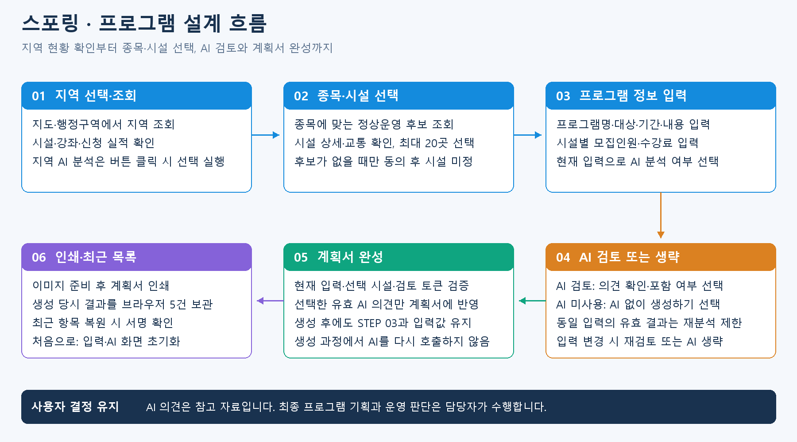


[이미지 크게 보기](docs/readme-assets/program-design-flow.png) · [SVG 원본](docs/readme-assets/program-design-flow.svg)


1. **지역 선택:** 지도·행정구역에서 지역을 조회하고 이용 시설·강좌·신청 실적·종목 분포를 확인합니다.

2. **종목·시설 선택:** 정상운영 후보의 상세·교통 정보를 확인하고 최대 20곳을 선택합니다. 실제 후보가 없을 때만 동의 후 시설 미정으로 진행합니다.

3. **정보 입력:** 프로그램명·모집인원·수강료·대상·기간·내용을 입력합니다. 수강료는 천 단위 쉼표로 표시하고 서버에는 정수로 전달합니다.

4. **AI 검토 또는 생략:** 현재 입력의 유효한 AI 결과가 있거나 AI 없이 생성하기를 선택해야 계획서를 완성할 수 있습니다.

5. **완성과 복원:** 생성 이후에도 STEP 03을 유지합니다. 최근 5건 복원·인쇄 시 AI를 재호출하지 않습니다.

6. **처음으로:** 입력·시설·화면의 AI 상태를 초기화하고 STEP 01 상단으로 이동합니다. 최근 5건과 서버 지역 AI 캐시는 삭제하지 않습니다.


<a id="ai-analysis-flow"></a>

### 7-2. AI 분석·검토 및 연동 흐름

지역 현황 분석과 프로그램 검토는 **근거 구성 → Gemini 호출 → 응답 검증 → 결과 제공**이라는 공통 흐름을 사용하며, 분석 대상과 결과 보관 방식이 다릅니다.

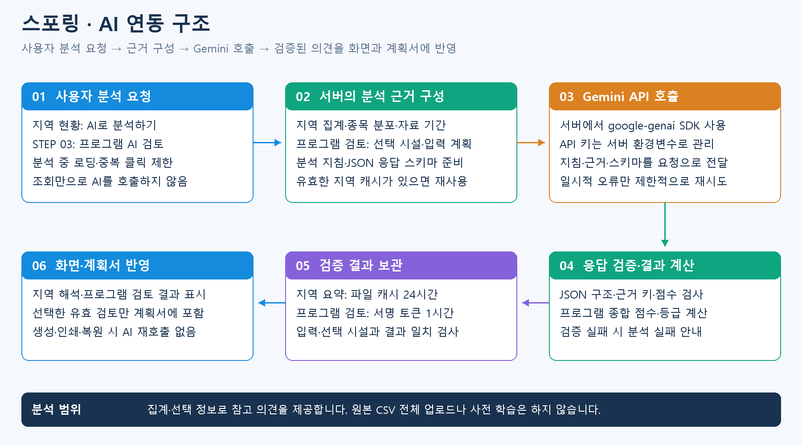

[이미지 크게 보기](docs/readme-assets/ai-integration.png) · [SVG 원본](docs/readme-assets/ai-integration.svg)

| 구분 | 지역 현황 분석 | 프로그램 AI 검토 |
|---|---|---|
| 실행 시점 | 지역 조회 후 AI로 분석하기 클릭 | STEP 03에서 AI 분석 클릭 |
| 분석 근거 | 지역·종목별 집계와 자료 기간 | 집계 자료 + 선택 시설 + 프로그램 입력 |
| 제공 결과 | 지역 요약·특징·기획 시 확인할 점 | 항목별 점수·의견·강점·위험·개선 제안 |
| 보관·재사용 | 서버 파일 캐시 24시간·최대 200건 | 현재 입력에 연결된 1시간 서명 토큰 |
| 결과 활용 | 지역 프로그램 기획 참고 | 사용자가 선택한 유효 결과를 계획서에 포함 |

**공통 처리**

1. **요청 구성:** 필요한 집계·시설·입력 정보와 분석 지침·응답 JSON 스키마를 구성합니다. 원본 CSV 전체 업로드나 모델 사전 학습은 수행하지 않습니다.
2. **AI 호출:** 서버의 `google-genai` SDK로 Gemini를 호출하며 API 키는 서버에서 관리합니다. 유효한 지역 캐시가 있으면 외부 호출 없이 재사용합니다.
3. **검증·제공:** JSON 구조·근거 키·점수를 검증합니다. 프로그램 종합 점수와 등급은 서버에서 계산하며, 평가 가능한 점수가 모두 없으면 **판단 자료 부족**으로 표시합니다. 통신·응답 오류는 아래 예외처리 항목을 따릅니다.

**입력 변경과 결과 유지**

- 지역 조회만으로 AI를 호출하지 않습니다. 다른 지역을 조회하면 이전 결과를 참고용으로 유지하고 재분석이 필요한 상태를 알립니다.
- 프로그램의 동일 입력에 대한 유효한 결과가 있으면 재분석을 제한합니다. 입력이 바뀌면 이전 결과는 유지하되 계획서 포함 선택을 해제합니다.
- 계획서에는 생성 당시 선택한 결과를 고정하며, 생성·인쇄·최근 목록 복원에서는 AI를 다시 호출하지 않습니다.

<details>
<summary>지역 AI 분석 진입 화면</summary>

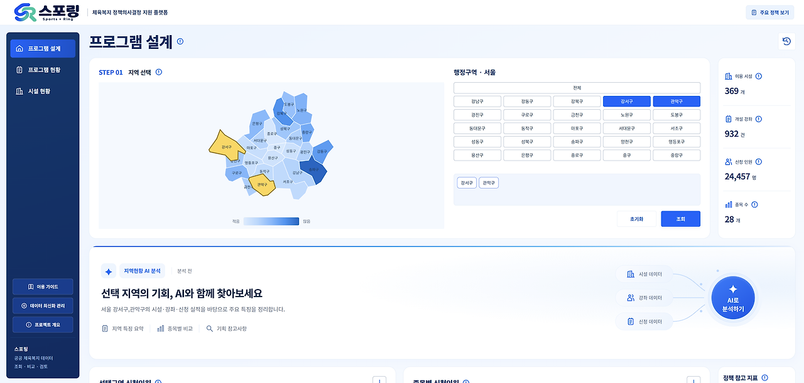

분석 실행 전의 진입 화면입니다.

</details>

<a id="exception-handling"></a>

### 7-3. 예외처리 구조


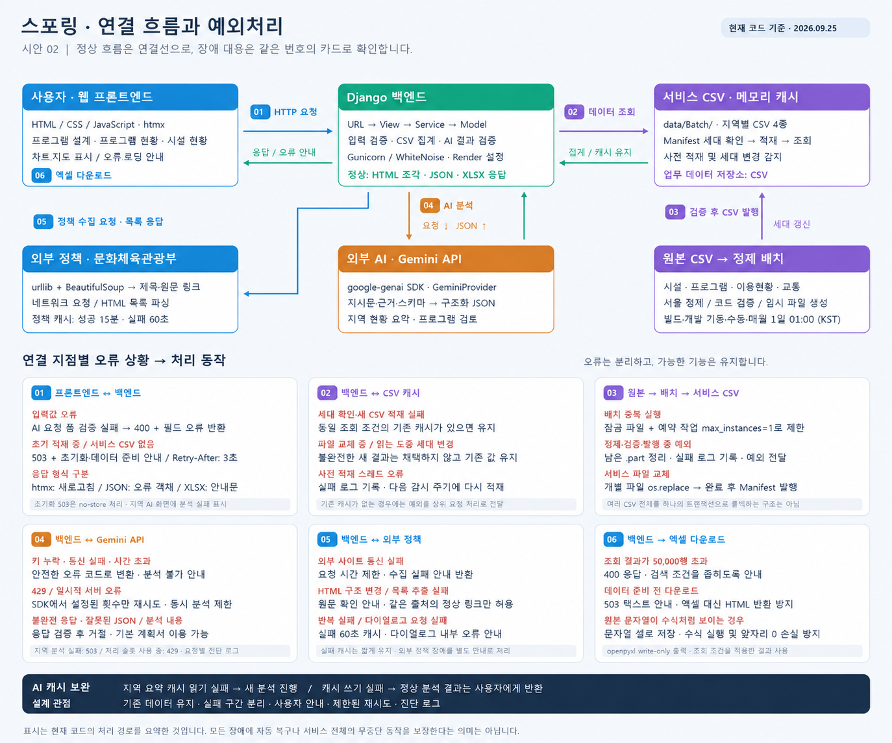


[예외처리 이미지 크게 보기](docs/readme-assets/exception-handling.png)


> 도식의 01\~06은 요청·캐시·배치·AI·정책·Excel의 연결 지점을 구분합니다. 장애가 난 구간을 안내하고 기존 정상 데이터와 가능한 기능을 유지하는 구조입니다. 모든 장애의 자동 복구를 의미하지 않습니다.


<details>

<summary><strong>계층별 처리 흐름과 예외처리 상세표</strong></summary>


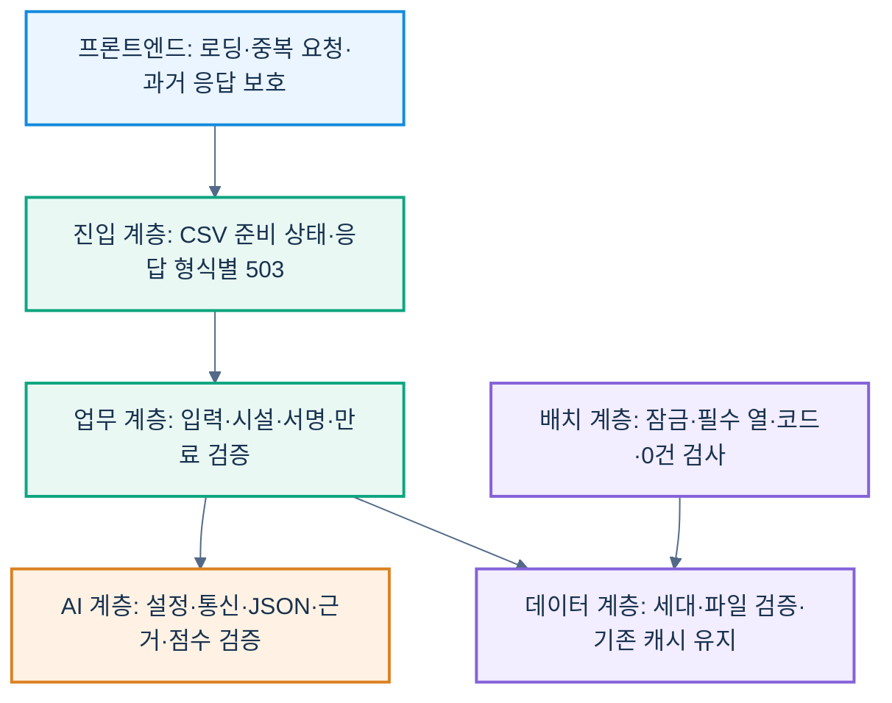
```mermaid
%%{init: {'theme': 'base', 'themeVariables': {'fontFamily': 'sans-serif', 'fontSize': '16px', 'lineColor': '#526A87', 'primaryTextColor': '#19324F', 'background': '#F5F8FC'}}}%%
flowchart TD
    UI[프론트엔드: 로딩·중복 요청·과거 응답 보호]
    Gate[진입 계층: CSV 준비 상태·응답 형식별 503]
    Biz[업무 계층: 입력·시설·서명·만료 검증]
    AI[AI 계층: 설정·통신·JSON·근거·점수 검증]
    Data[데이터 계층: 세대·파일 검증·기존 캐시 유지]
    Batch[배치 계층: 잠금·필수 열·코드·0건 검사]
    UI --> Gate --> Biz
    Biz --> AI
    Biz --> Data
    Batch --> Data
    classDef front fill:#EAF5FF,stroke:#148BDD,color:#19324F,stroke-width:2px
    classDef backend fill:#E9F8F3,stroke:#0FA580,color:#19324F,stroke-width:2px
    classDef data fill:#F2EDFF,stroke:#8562D9,color:#19324F,stroke-width:2px
    classDef ai fill:#FFF2E4,stroke:#DB8121,color:#19324F,stroke-width:2px
    class UI front
    class Gate,Biz backend
    class AI ai
    class Data,Batch data
```


주석 번호는 실제 소스의 표기를 따릅니다. `—`는 해당 처리에 명시된 번호가 없다는 뜻이며, 위 이미지의 연결 지점 번호 `01~06`과는 별개입니다. 링크는 해당 주석이 있는 소스로 연결됩니다.

| 계층 / 상황 | 처리 | 한계·후속 동작 |
|---|---|---|
| 조회 응답 역전 | 요청 버전으로 과거 응답 무시 | 최신 요청 결과만 표시 |
| 로딩·조회 실패 | 오류 안내, finally에서 로딩 해제 | 자동 재시도와 구분 |
| AI 화면 오류 안내 | JSON이 아닌 오류 응답도 안내, 선택적 UI 요소의 부재 처리 | 일반 목록 조회 오류와 구분 |
| CSV 초기 준비 | loading·missing은 형식에 맞는 503, Retry-After | stalled는 요청을 통과시켜 직접 적재 허용 |
| 입력 오류 | 날짜 순서·인원·금액·시설 개수 검사 | 오류 항목 재입력 |
| 시설 선택 | 2시간 서명 토큰과 현재 후보 대조 | 변조·만료·불일치 시 재선택 |
| 시설 미정 허용 | 사용자 동의와 실제 후보 부재를 함께 확인 | 검색어 때문에 결과가 없는 경우와 구분 |
| 시설·교통 데이터 | 파일·열 누락, 읽기 실패, 좌표 없음, 수록 대상 밖을 구분해 안내 | 읽다 만 색인을 정상 결과로 사용하지 않음 |
| 결과 복원 | 서명·구조·크기 검사 | 손상 결과 복원 거부 |
| AI 연동 | 키·SDK·통신·시간 초과·JSON·근거·점수 검증 | 실패 안내 후 기본 계획서 이용 가능 |
| AI 재시도 | 429·500·502·503·504만 최대 10회 재시도 | 최초 호출 이후 횟수이며 전체 응답시간은 길어질 수 있음 |
| AI 검토 토큰 | 1시간 유효시간·입력·시설 일치 검사 | 재검토 또는 포함 해제 |
| 지역 AI 캐시 | 손상 캐시 재분석, 쓰기 실패 시 결과 제공 | 분석 중 CSV 세대 변경 시 캐시 저장 안 함 |
| 정책 목록 | 다이얼로그·로딩 먼저 표시, 오류 문구 제공 | 서버 크롤링 자체는 동기 방식 |
| 브라우저 저장 | 파싱·용량·저장 실패 처리 | 보관 실패가 생성·인쇄를 막지 않도록 처리 |
| Excel | 최대 50,000행 제한 | 초과 시 조건 축소 안내 |
| CSV 재적재 실패 | 기존 정상 캐시가 있으면 유지 | 최초 적재 실패 시 기존 캐시가 없어 준비 상태·오류 안내 |
| 배치 원본 누락 | 실패 기록·기존 서비스 파일 유지·다이얼로그에 누락 파일과 복구 안내 표시 | 원본 복구 후 재실행 |
| 배치 추출·검증 실패 | 임시 파일 정리·오류 로그 기록 | 최종 파일 교체 전 실패하면 기존 서비스 파일 유지 |
| 서비스 파일 교체 실패 | 오류 로그 기록 | 파일별 교체이므로 여러 CSV 전체의 일괄 롤백은 보장하지 않음 |

**기동 대기 문제 개선:** Gunicorn master에서 CSV 갱신 스레드를 시작하면 fork 후 잠금·스레드 상태가 불일치할 수 있어, 워커 초기화 이후 적재와 스케줄러를 시작하도록 분리했습니다. 준비 상태와 PID별 `CSV_DIAG` 로그로 추적합니다.


**AI 진단:** 요청 ID로 처리 단계·SDK 설정·응답 상태·오류 분류를 기록합니다. API 키·사용자 작성 내용·AI 응답 본문은 로그에 남기지 않습니다. 프로세스당 AI 분석은 1건으로 제한합니다.


</details>


<a id="policy-crawling"></a>

### 7-4. 주요 정책 크롤링 흐름

문화체육관광부의 체육정책 목록에서 **제목과 원문 링크를 최대 10건 추출**하여 제공합니다. 정책 본문과 첨부파일은 수집하지 않으며, 사용자가 원문을 새 창으로 열어 확인합니다.

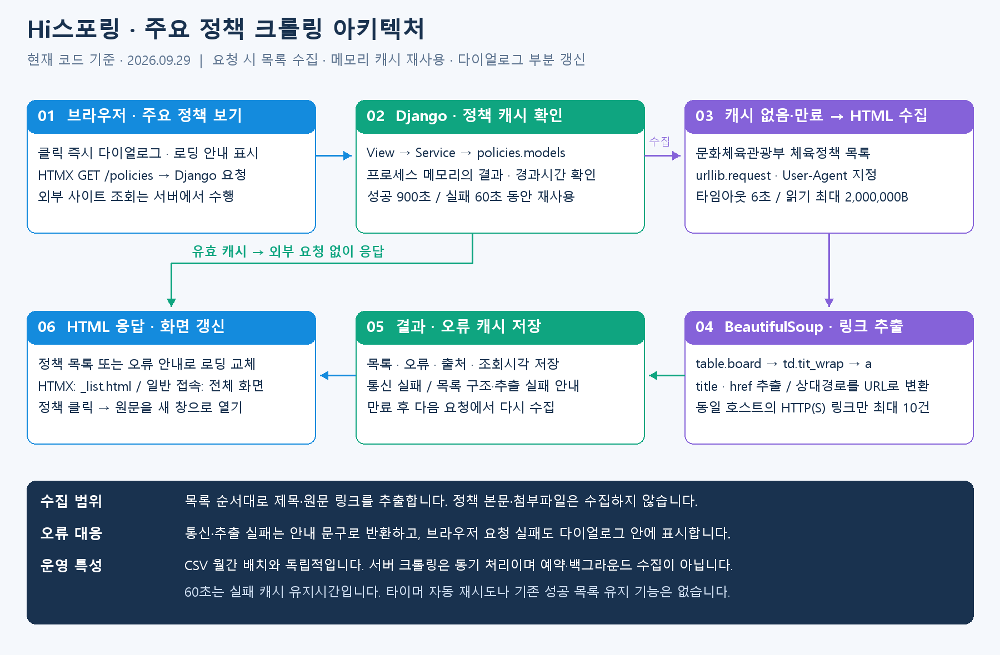

[이미지 크게 보기](docs/readme-assets/policy-crawling-architecture.png) · [SVG 원본](docs/readme-assets/policy-crawling-architecture.svg)

1. **조회 요청:** 주요 정책 보기 클릭 즉시 로딩 다이얼로그를 표시하고, HTMX로 Django 서버에 목록을 요청합니다.
2. **캐시 확인:** 프로세스 메모리에 유효한 결과가 있으면 재사용합니다. 성공 결과는 15분, 실패 결과는 60초 동안 보관합니다.
3. **수집·파싱:** 캐시가 없거나 만료되면 `urllib.request`로 목록 HTML을 조회하고, BeautifulSoup으로 제목·링크를 추출합니다. 요청 타임아웃은 6초, 읽기 크기는 최대 2,000,000바이트이며 동일 호스트의 HTTP(S) 링크만 허용합니다.
4. **화면 반영:** 결과를 캐시에 저장하고 HTML 조각을 반환하여 로딩 화면을 목록으로 교체합니다. 통신·목록 추출 실패 또는 브라우저 요청 실패 시 다이얼로그 안에 오류를 안내합니다.

**CSV 월간 배치와 독립된 요청 기반 기능입니다.** 서버 크롤링은 동기 처리이며, 실패 캐시의 60초가 지나도 자동 재시도하지 않습니다. 캐시 만료 후 다음 조회 요청에서 다시 수집합니다.

<a id="results"></a>

## 8. 구현 결과·테스트·시연


### 8-1. 주요 구현 화면

#### 프로그램 설계 및 AI검토

지역 현황 확인부터 시설 선택, 프로그램 입력과 AI 검토까지 단계별로 진행합니다.

**STEP 01 · 지역 선택 및 AI 현황 분석**

행정구역을 선택해 시설·강좌·신청 실적과 종목 분포를 확인하고, AI 분석을 요청해 지역의 특징과 기획 시 확인할 점을 살펴봅니다.

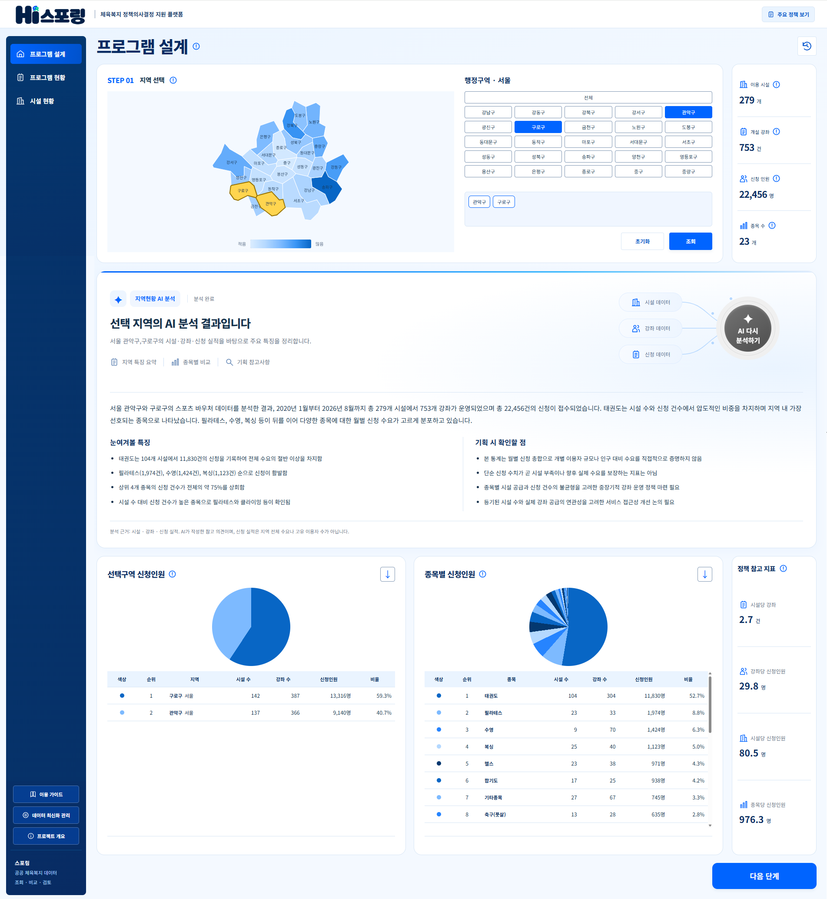

*관악구·구로구의 지역 지표, AI 현황 요약 및 종목별 신청 실적을 확인하는 화면*

**STEP 02 · 종목·시설 선택**

종목과 시설명·주소로 후보를 검색하고, 시설 상세 정보와 제공되는 교통 정보를 확인한 뒤 계획서에 포함할 시설을 선택합니다.

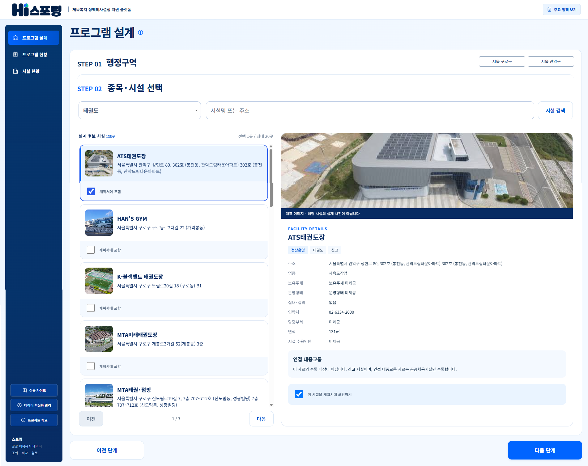

*태권도 시설 후보와 선택 시설의 상세 정보를 확인하는 화면. 시설 이미지는 실제 사진이 아닌 대표 이미지입니다.*

**STEP 03 · 프로그램 정보 입력 및 AI 검토**

프로그램명·모집인원·수강료·대상·기간·내용을 입력하고 AI 검토를 요청합니다. 제공된 근거에 따른 항목별 평가와 개선 의견을 확인하고, 결과의 계획서 포함 여부를 선택해 계획서를 완성합니다. AI 검토 없이 생성하는 방식도 지원합니다.

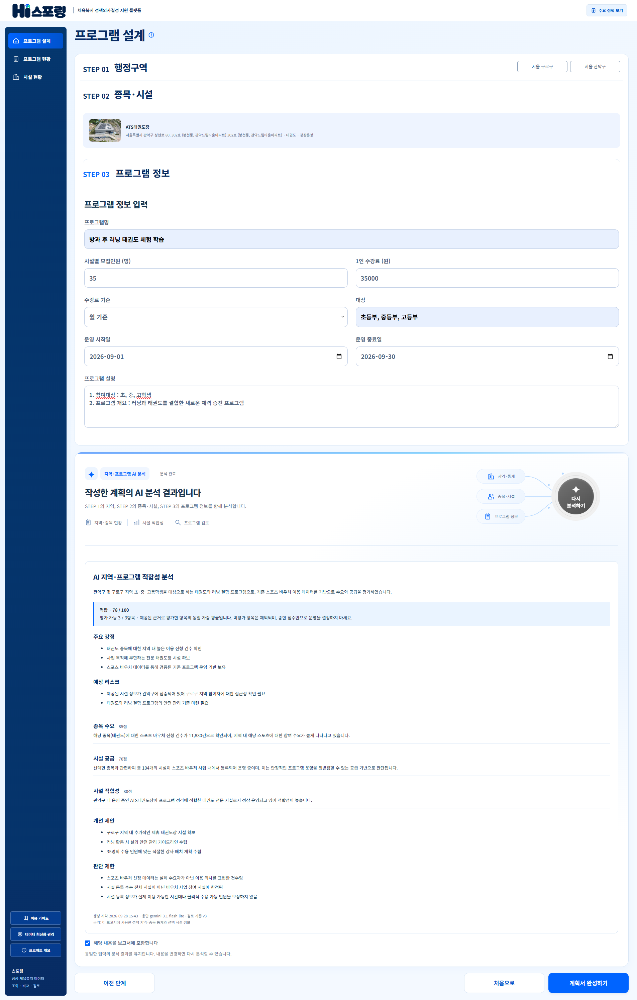

*입력한 프로그램의 AI 평가·강점·위험요인·개선 제안을 확인하는 화면. 표시된 점수는 해당 입력의 검토 예시이며 실제 운영 성과를 의미하지 않습니다.*


#### 프로그램 현황


지역·종목·요일·수강료 등의 조건으로 검색하고 기존 강좌를 비교하며 Excel로 내보냅니다.


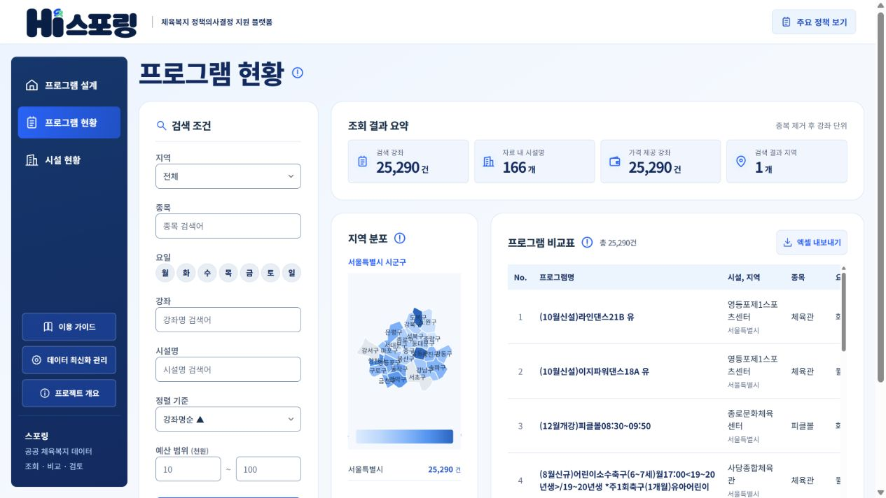


#### 시설 현황


지역·시설 유형·운영상태로 검색하고 시설 상세와 연결 가능한 인접 교통 정보를 확인합니다.


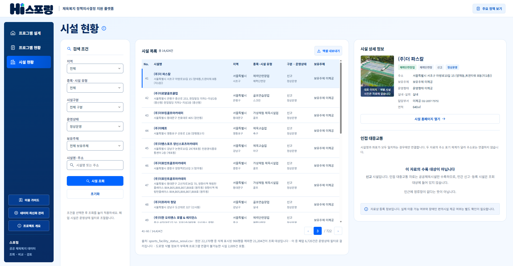


#### 주요 정책 보기

문화체육관광부 체육정책 목록을 조회합니다. 다이얼로그에 로딩 안내를 먼저 표시하고, 조회가 완료되면 정책 목록과 원문 링크를 제공합니다.

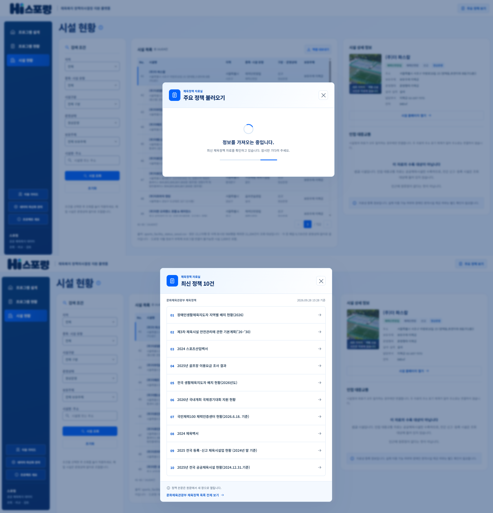

*상단: 정책 정보를 가져오는 중 / 하단: 조회 완료 후 최신 정책 10건 표시*


### 8-2. 시연 순서


1. 지역 선택·조회 후 지표와 종목 분포를 확인합니다.

2. 지역 AI 분석 버튼으로 현황 요약을 확인합니다.

3. 종목과 시설을 선택하고 프로그램 내용을 입력합니다.

4. 프로그램 AI 검토 또는 AI 없이 생성하기를 선택합니다.

5. 계획서를 완성하고 인쇄·최근 목록 복원을 확인합니다.


### 8-3. 테스트 기록


| 항목 | 확인 결과 | 비고 |
|---|---|---|
| 프로젝트 개요 화면·AI 설명 | 6개 테스트 통과 | 2026-09-28 로컬 실행 |
| 대시보드·프로그램·시설 화면 | 로컬 화면 열림과 캡처 확인 | 기능 전체 회귀 테스트는 아님 |
| 설계·인쇄 | 프로그램 설계 및 인쇄 확인  | 실제 테스트 일시·증빙 입력 |
| AI 성공·실패·재분석 | 로그에서 AI 호출 확인 | 실제 공급자 호출 결과 입력 |
| 배치·초기화·갱신 | 강제 실행 로그 확인 | 실제 테스트 일시·증빙 입력 |
| 운영 환경·통합 시연 | Render환경 서비스 확인 | Render 환경에서 별도 확인 |


<a id="retrospective"></a>

## 9. 한 줄 회고

#### 홍석환
좋은 팀원들과 함께 아이디어를 구체화하고 하나의 서비스로 만들어가는 과정을 경험할 수 있어 뜻깊었습니다. 기획부터 UI 구성과 수정, 다양한 프레임워크와 라이브러리를 활용한 구현까지 참여하며, 개별 코드가 서로 연결되어 서비스로 작동하는 흐름을 이해할 수 있었습니다. 특히 AI를 활용한 바이브 코딩은 구현의 진입 장벽을 낮추고 여러 아이디어를 빠르게 시도하는 데 도움이 되었습니다. 동시에 원하는 결과를 얻으려면 요구사항을 구체적으로 정의하고, 생성된 코드의 동작과 결과를 직접 검토하는 과정이 중요하다는 점도 배웠습니다. 이번 프로젝트는 코드를 작성하는 것을 넘어, 사용자의 관점에서 기능과 화면을 다듬고 서비스 전체의 연결을 고민해 본 경험이었습니다.

#### 서정길
프로젝트 수행 과정 전반에 AI를 활용했다는 점이 새롭게 다가왔습니다. 기존이었다면 처음 접해보는 파이썬 Django 프레임워크와 Render 서비스 구축 과정에서 많은 시간을 허비했겠지만, AI를 활용하면서 발생하는 오류를 직접 확인하고 해결해 나갈 수 있었습니다. 다만 현재 제공되는 데이터셋이 CSV 형태로만 구성되어 있어 엔터프라이즈급 기능으로 확장하는 데 한계가 있었던 점은 아쉬움으로 남았습니다. 추후 신규 프로젝트를 구축할 때에는 초기 단계부터 데이터 구조와 저장 방식에 대한 설계를 좀 더 상세하게 진행해야겠다고 생각했습니다.

#### 설호현
담당 기능을 구현하는 것만큼 예외 상황을 어떻게 처리할지 고민하는 일도 중요하다는 것을 다시 배웠습니다. 처음으로 전국 단위 CSV를 서울 데이터로 정제하면서 ‘서울’과 ‘서울특별시’처럼 다른 표기를 통일하고, 구 이름만 남은 행은 지역 코드와 주소를 확인해도 서울로 특정할 수 없으면 제외했습니다. 이 과정을 통해 데이터를 쓰기 전에 그 의미와 품질을 확인하는 일이 얼마나 중요한지 느꼈고, 이번에는 데이터 정제 과정을 익히기 위해 CSV를 사용했지만 앞으로는 정제한 데이터를 DB에 적재하고 갱신하는 방식도 구현해 보고 싶습니다.

---


<a id="improvements"></a>

## 10. 현재 제약사항 및 향후 개선사항

### 10-1. 현재 제약사항


- 대시보드는 서울 중심이며 시설 후보가 공공시설로만 제한되지는 않습니다.

- 대관·강사·접수·결제·개설 확정과 실제 문자·카카오톡 발송은 구현 범위 밖입니다.

- 최근 계획서는 해당 브라우저 5건이며 계정·기기 간 동기화가 없습니다.

- AI 재시도는 수 분 걸릴 수 있으며 프록시 제한으로 먼저 연결이 종료될 수 있습니다.

- 프로세스 간 전역 AI 호출 제한, 사용자별 할당량, 일일 비용 제한은 미구현입니다.

- 파일 캐시는 배포 환경에 따라 초기화될 수 있습니다. 실제 기관 도입·정량적 효과는 별도 검증이 필요합니다.

### 10-2. 향후 데이터 구조 확장

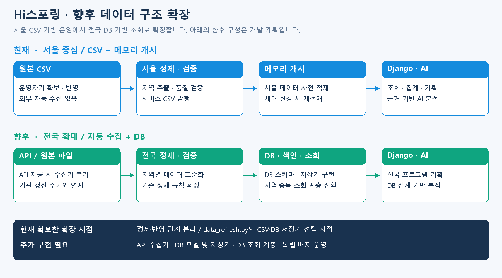

[이미지 크게 보기](docs/readme-assets/data-expansion-flow.png) · [SVG 원본](docs/readme-assets/data-expansion-flow.svg)

| 방향 | 개선 계획 |
|---|---|
| 원본 수집 자동화 | 데이터별 실제 갱신일·주기를 확인하고, 원본 제공 API가 마련되면 수집·검증 단계를 기존 정제 작업 앞에 연결합니다. 현재 자동 수집기는 미구현이며 정제·반영 단계가 분리되어 있습니다. |
| 전국 데이터·DB 전환 | 전국 조회에 맞는 DB 스키마·지역/종목 색인·조회 계층을 구현합니다. 현재 `data_refresh.py`에 CSV/DB 저장기 선택 지점은 있으나 DB 저장기와 조회 전환은 추가 개발이 필요합니다. |
| 배치 신뢰성 | 서버와 독립된 예약 실행, 실패 알림·제한된 재시도, 원본 체크섬 비교와 여러 파일의 일괄 발행을 보완합니다. |
| 최신성 표시 | 기관 원본의 기준일·갱신일과 서비스 반영일을 구분하여 사용자가 자료의 최신성을 확인하도록 개선합니다. |

---

<a id="appendix"></a>

## 부록 · 실행 및 참고 자료

### 실행 및 환경 설정


<details>

<summary><strong>로컬 실행 명령과 AI 환경변수</strong></summary>


Python 가상환경에서 `main/requirements.txt`를 설치하고 원본 데이터를 준비합니다. 데이터 압축 해제·배치·운영 배포의 세부 절차는 [Render 배포 안내](docs/RENDER-DEPLOYMENT.md)를 참고합니다.


```powershell
python -m venv .venv
.\.venv\Scripts\python.exe -m pip install -r main/requirements.txt
.\.venv\Scripts\python.exe main/manage.py migrate
.\.venv\Scripts\python.exe main/manage.py runserver 127.0.0.1:8000
```


루트 `.env` 예시:


```dotenv
AI_MODE=live
AI_PROVIDER=gemini
AI_MODEL=gemini-3.1-flash-lite
AI_TIMEOUT_SECONDS=25
AI_MAX_RETRIES=10
GEMINI_API_KEY=발급받은_API_키
AI_REVIEW_INCLUDE_TRANSIT=false
```


외부 호출 없는 동작 확인에는 `AI_MODE=dummy`를 사용합니다. 더미 결과는 실제 AI 검토 성과와 구분합니다. Render에서는 같은 변수를 Environment에 등록하며 기존 OS·Render 환경변수가 `.env`보다 우선합니다. 실제 `.env`와 API 키는 Git에 포함하지 않습니다.


</details>

### 관련 문서 및 작성 근거


- [프로젝트 개요 템플릿](main/templates/overview/index.html)

- [AI 공통 계약](main/app/ai_review/contracts.py) · [공급자 팩토리](main/app/ai_review/factory.py)

- [지역 배치](main/app/Batch/regional_csv_batch.py) · [Gunicorn 설정](gunicorn.conf.py)

- [라이브러리 선언](main/requirements.txt) · [Render 배포 안내](docs/RENDER-DEPLOYMENT.md)

<!-- README와 docs/readme-assets를 함께 저장소에 반영해야 캡처 이미지가 표시됩니다. Mermaid 도식은 GitHub README에서 렌더링됩니다. -->
