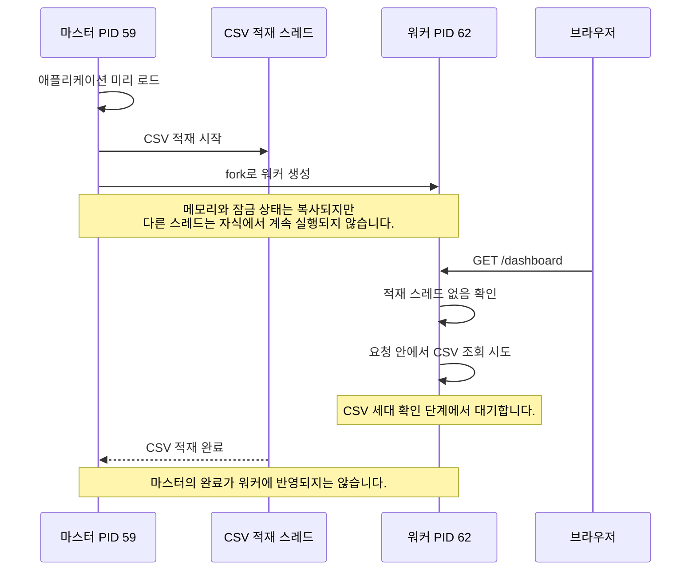
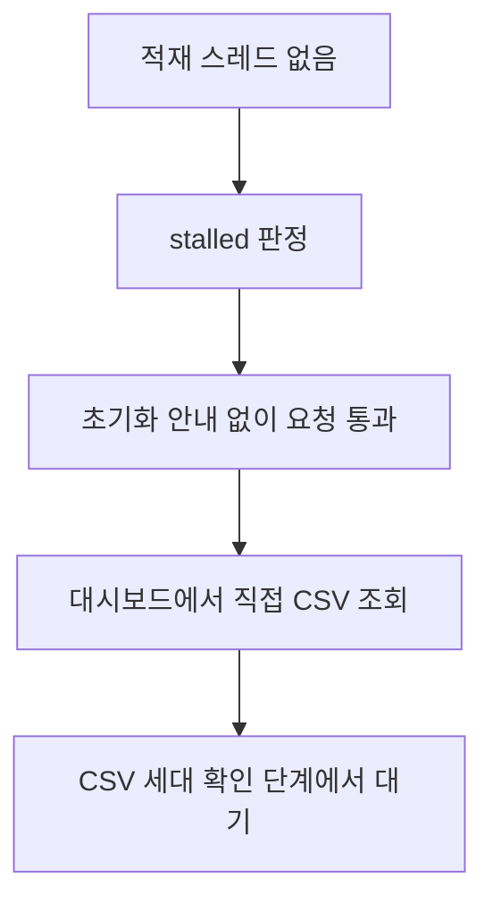
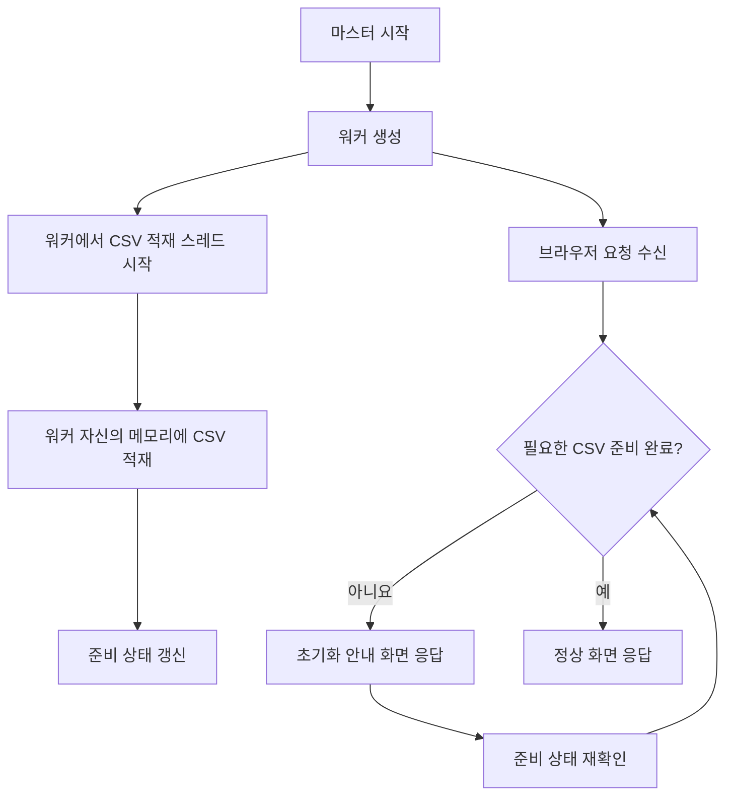

# CSV 적재는 끝났는데 브라우저는 왜 계속 기다릴까요?

CSV 사전 적재 기능에 초기화 안내 화면을 추가한 뒤, 서버 로그에는 CSV 적재가 완료됐지만 브라우저에서는 응답 없이 계속 기다리는 문제가 발생했습니다.

처음에는 CSV를 반복해서 읽는 무한 루프를 의심했습니다. 하지만 진단 로그를 추가해 확인한 결과, 문제는 **Gunicorn의 프로세스 생성 시점과 백그라운드 스레드의 실행 위치**에 있었습니다.

## 1. 초기화 화면을 추가한 이유

기존에는 서버 기동 과정에서 CSV를 동기적으로 메모리에 적재했습니다. 적재가 끝나야 요청을 처리할 수 있어, 사용자가 접속하면 안내 없이 기다리게 됐습니다.

이를 개선하기 위해 CSV 적재를 백그라운드 스레드로 옮겼습니다. 의도한 동작은 다음과 같습니다.


그러나 실제 배포 후에는 초기화 화면 대신 브라우저가 계속 응답을 기다렸습니다.

## 2. CSV 무한 적재 문제는 아니었습니다

수집한 로그에는 세 파일 모두 적재 완료가 기록돼 있었습니다.

```text
CSV 메모리 적재 완료: sports_facility_status_seoul.csv
CSV 메모리 적재 완료: sports_voucher_usage_seoul.csv
CSV 메모리 적재 완료: public_sports_program_seoul.csv
```

코드에서도 일정 간격으로 파일 변경 여부만 확인하고, 같은 데이터 세대라면 메모리 캐시를 재사용하고 있었습니다.

따라서 CSV를 얼마나 자주 읽는지보다, **CSV 적재를 완료한 프로세스가 실제 사용자 요청을 처리하는 프로세스와 같은지**를 확인해야 했습니다.

## 3. 진단 로그에서 발견한 차이

원인을 찾기 위해 다음 단계에 로그를 추가했습니다.

- Gunicorn의 실제 `preload` 설정
- 마스터와 워커의 PID
- CSV 적재 스레드 시작
- CSV 잠금 대기·획득 및 읽기 시작·완료
- 요청 시작·종료
- 초기화 상태 판정
- 대시보드 데이터 조회 및 렌더링

핵심 로그를 정리하면 다음과 같습니다.

```text
pid=59 CSV_DIAG warmup.start
pid=59 CSV_DIAG watch.begin

CSV_DIAG gunicorn.start pid=59 preload=True workers=1 threads=4
CSV_DIAG worker.fork pid=62 parent=59
CSV_DIAG worker.init pid=62
```

CSV 적재는 **마스터 PID 59**에서 시작됐습니다. 이후 사용자 요청을 처리할 **워커 PID 62**가 만들어졌습니다.

워커가 대시보드 요청을 받았을 때의 상태는 다음과 같았습니다.

```text
pid=62 CSV_DIAG request.begin path='/dashboard'
pid=62 CSV_DIAG gate.result state='stalled' active=False
pid=62 CSV_DIAG dashboard.begin
pid=62 CSV_DIAG cache.version.begin
```

여기서 두 가지를 확인할 수 있었습니다.

1. 워커에는 살아 있는 CSV 적재 스레드가 없었습니다.
2. 요청은 CSV 세대 확인 단계에 들어간 뒤 다음 단계로 진행하지 못했습니다.

반면 적재 완료 로그는 계속 마스터에서 출력됐습니다.

```text
pid=59 CSV_DIAG watch.first_pass.end
loaded=[('facilities', True), ('usage', True), ('programs', True)]
```

**마스터의 적재 완료가 워커의 적재 완료를 의미하지 않았습니다.**

## 4. 원인은 워커 생성 전에 시작된 스레드였습니다

서버의 두 역할을 먼저 구분하면 이해하기 쉽습니다.

| 역할 | 담당 작업 |
|---|---|
| 마스터 | 서버를 관리하고 워커를 생성합니다. |
| 워커 | 브라우저 요청을 받아 실제 화면을 만듭니다. |

운영 환경의 실제 Gunicorn 설정은 `preload=True`였습니다. 이 설정에서는 마스터가 애플리케이션을 먼저 불러온 뒤 워커를 생성합니다.

그런데 기존 코드는 WSGI 모듈을 불러오는 과정에서 CSV 적재 스레드도 시작하고 있었습니다.



멀티스레드 프로세스에서 `fork`가 발생하면, 자식 프로세스에는 `fork`를 호출한 스레드만 남습니다. 다른 스레드가 보유하던 잠금 상태가 복사되면, 자식에서는 그 잠금을 해제할 작업자가 없어질 수 있습니다.

쉽게 비유하면 **잠긴 창고는 복사했지만, 열쇠를 가진 작업자는 원래 창고에만 남은 상황**입니다.

마스터가 자신의 작업을 끝내더라도 이미 분리된 워커의 메모리와 잠금 상태가 함께 갱신되지는 않습니다.

이번 로그에서는 정확히 어느 내부 잠금에서 멈췄는지까지 확정하지는 못했습니다. 다만 다음 정황은 이러한 잠금 상속 문제와 일치했습니다.

- 마스터에서 CSV 적재 스레드가 먼저 시작됐습니다.
- 적재 중 워커가 생성됐습니다.
- 워커에서는 적재 스레드가 비활성 상태였습니다.
- 워커 요청이 CSV 세대 확인 단계에서 진행되지 않았습니다.

## 5. 초기화 화면도 나오지 않은 이유

초기화 상태 판정에는 복구 동작이 있었습니다. 적재 스레드가 없으면 `stalled`로 판단하고, 요청이 직접 CSV를 읽도록 통과시키는 방식이었습니다.



일반적인 적재 스레드 중단 상황을 위한 복구 경로였지만, 프로세스 생성 과정에서 물려받은 잠금 문제까지 해결할 수는 없었습니다.

또한 서버는 워커 1개, 요청 처리 스레드 4개로 설정돼 있었습니다. 로그에서 대시보드 요청 4개가 같은 단계에 멈췄고, 이후 요청을 처리할 여유도 사라졌습니다.

## 6. 워커 생성 후 CSV 적재를 시작하도록 수정했습니다

수정 방향은 **CSV 적재 스레드를 마스터에서 시작하지 않고, 워커가 생성된 뒤 시작하는 것**이었습니다.

Gunicorn 설정 파일에서 적재 시작을 Gunicorn이 관리한다는 표시를 설정했습니다.

```python
# gunicorn.conf.py
import os

# WSGI를 미리 불러오더라도 마스터에서는 CSV 스레드를 시작하지 않습니다.
os.environ["CSV_WARMUP_MANAGED_BY_GUNICORN"] = "true"
```

WSGI와 ASGI 진입점에서는 이 설정이 있으면 적재 시작을 건너뛰도록 변경했습니다.

```python
from app.runtime.csv_warmup import start_csv_warmup

if os.environ.get("CSV_WARMUP_MANAGED_BY_GUNICORN") != "true":
    start_csv_warmup()
```

실제 적재 시작은 Gunicorn의 `post_worker_init`으로 옮겼습니다. 아래 코드는 핵심 변경 부분만 정리한 예시입니다.

```python
# gunicorn.conf.py
def post_worker_init(worker):
    from app.runtime.csv_warmup import start_csv_warmup

    start_csv_warmup()

    # 기존 스케줄러 초기화 등은 유지합니다.
```

수정 후 구조는 다음과 같습니다.



이제 사용자 요청을 처리하는 워커가 자신의 데이터를 직접 준비합니다. 적재 작업과 잠금도 같은 프로세스 안에서 관리됩니다.

이 방식은 해당 Gunicorn 설정 파일을 사용하는 것을 전제로 합니다. `CSV_WARMUP_MANAGED_BY_GUNICORN`은 설정 파일 내부에서 지정하며, 독립 실행 환경에 별도로 설정하지 않습니다. 배포 실행 명령에서도 `--config gunicorn.conf.py`를 유지해야 합니다.

## 7. 검증과 배포 후 확인 항목

수정 후 관련 테스트 **50개가 통과했습니다.** 추가한 회귀 테스트에서는 다음을 확인했습니다.

- Gunicorn 설정을 적용한 WSGI·ASGI 로딩 단계에서 적재를 시작하지 않는지 확인했습니다.
- `post_worker_init`에서 적재를 시작하는지 확인했습니다.
- Gunicorn이 관리하지 않는 실행 환경에서는 기존처럼 적재를 시작하는지 확인했습니다.

다만 로컬 테스트만으로 실제 Linux/Gunicorn의 프로세스 생성 동작까지 검증한 것은 아닙니다. 이 글 작성 시점에는 재배포 후 운영 로그 확인이 남아 있습니다.

정상적인 로그 흐름은 다음과 같습니다.

```text
pid=62 worker.init
pid=62 warmup.start
pid=62 watch.begin
pid=62 cache.publish
```

**워커 초기화와 CSV 적재 로그가 같은 워커 PID로 기록되는지**가 핵심입니다. 이어서 대시보드 요청에 `request.end` 로그와 정상 응답 상태가 기록되는지도 확인해야 합니다.

## 8. 이번 장애에서 얻은 교훈

“적재 완료” 로그만으로 서비스 준비 완료를 판단해서는 안 됩니다. 프로세스가 여러 개인 서버에서는 **어느 프로세스가 완료했는지**까지 확인해야 합니다.

또한 동기 작업을 백그라운드 스레드로 바꿀 때는 실행 위치까지 함께 검토해야 합니다. 특히 Gunicorn처럼 프로세스를 생성하는 서버에서는 애플리케이션을 불러오는 시점과 실제 요청을 처리하는 워커의 초기화 시점이 다를 수 있습니다.

이번 문제에서는 CSV를 읽는 로직보다 **CSV를 읽기 시작하는 시점**이 중요했습니다. 적재 시작을 워커 초기화 단계로 옮겨, 프로세스 생성 전에 실행 중인 적재 스레드의 잠금이 워커에 전달되는 상황을 방지하도록 수정했습니다.

---

※ 본문의 다이어그램은 Mermaid 형식입니다. 게시할 블로그 편집기가 Mermaid를 지원하는지 확인해야 합니다.
